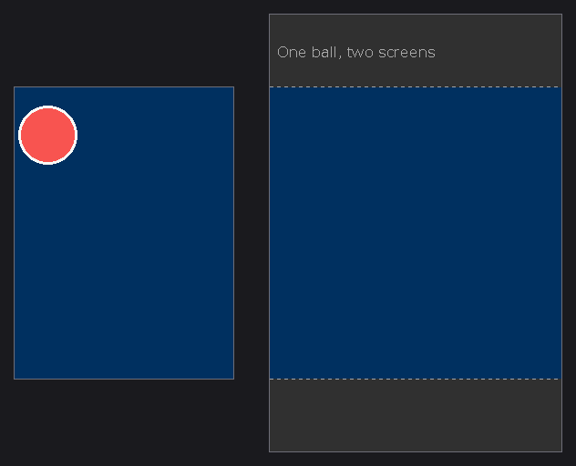
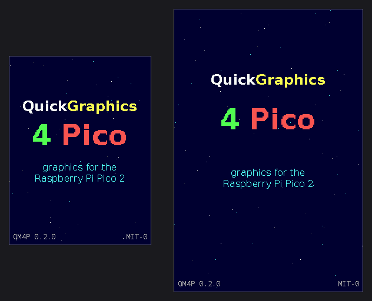
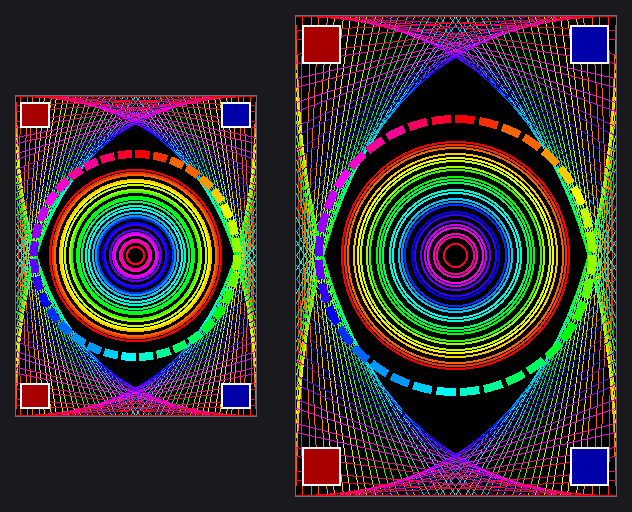
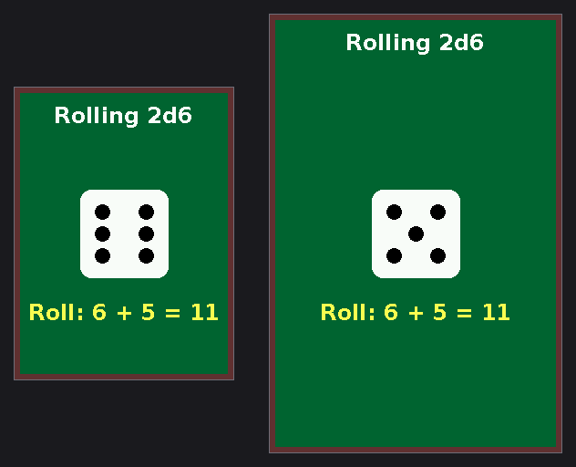

# QM4P: QuickMedia 4 Pico

Small libraries for the Raspberry Pi Pico 2, in the spirit of QuickBasic: graphics and asset packs, each with a friendly API. Every library lives in its own folder and needs only the Pico SDK, never another library, so a project copies in just the folders it uses and carries nothing else. They share one style (simple calls, plain-English comments, "pay only for what you use") and one [register of the hardware each uses](docs/RESOURCES.md), so they can run side by side on one chip.



| Library | Folder | What it is | Copy it when |
|---|---|---|---|
| **QG4P**, QuickGraphics 4 Pico | `qg4p/` | Graphics on small SPI screens: `CLS`, `PSET`, `LINE`, `CIRCLE`, `PAINT`, `LOCATE`, `PRINT`, fonts, images, flicker-free framebuffers | your project draws on a screen |
| **QA4P**, QuickAssets 4 Pico | `qa4p/` | Asset packs: images, text and data, built on the PC and found by name in flash; several packs open at once | you want files kept out of your program, to change them without rebuilding it |

> **Too busy to read a manual?** [Everything on one page](docs/manual/quick-reference.md).
>
> **The manual is in [`docs/manual`](docs/manual/README.md):** quick answers, 17 examples, a reference entry with a working example and a picture for every function, tools, troubleshooting, getting started, adding a new display chip, and how it all works.

## What it looks like

`qg4p_showcase` turns two screens into one wide picture and runs through what the library can do, about 30 seconds a loop. These are its screens, drawn on a PC by the real library code and laid side by side at 1:1, the way they sit on the bench:

| Title | Shapes | Dice roll |
|---|---|---|
|  |  |  |

**Every picture here is drawn without a framebuffer.** Both screens run DIRECT: each shape lands on the glass the moment it's drawn, a moving ball is erased by painting the background back over where it was, and the whole program fits in about 16 KB of RAM. QG4P also has framebuffer screens (BUF8). A framebuffer is a sketchpad: you draw in private, then hold the finished page up to the screen in one go. That's where whole-scene animation without a flicker lives, along with PAINT, POINT, GET/PUT sprites and palette animation; examples 9 to 12 and the dice roller in [`examples/`](examples/README.md) show them off. If this is what the library does with no sketchpad, imagine what it does with one.

Wire two screens, set `examples/board.h`, flash `qg4p_showcase`.

## QG4P: QuickGraphics 4 Pico

Graphics for the Raspberry Pi Pico 2 and small SPI screens, in the spirit of QuickBasic: `CLS`, `PSET`, `LINE`, `CIRCLE`, `PAINT`, `LOCATE`, `PRINT`, plus fonts, images and optional flicker-free framebuffers. Small, fast, and commented so heavily it doubles as a textbook. With QA4P, its images and text can come from an asset pack.

## Repository layout

```
CMakeLists.txt   builds everything: every library, example and test program
qg4p/            QuickGraphics: copy this folder into your project
  qg4p.h         the one header a program includes
qa4p/            QuickAssets: copy this folder too if you use an asset pack
  qa4p.h         its one header
examples/        17 example programs, each its own build target qg4p_<name> (wiring: examples/board.h)
tests/
  hardware/      the test programs used to develop the libraries, one per milestone,
                 and run_all.sh, which flashes each in turn and asks what you saw
  host/          tests that run on a PC, no Pico needed
tools/           font, image and asset-pack converters; size report and audit
docs/            the manual (docs/manual); hardware resources (RESOURCES.md);
                 wiring, sizes, design notes, history
```

## Using it

Copy the library folders you need next to your `CMakeLists.txt`, then:

```cmake
add_subdirectory(qg4p)
add_subdirectory(qa4p)                                  # only with an asset pack
target_link_libraries(my_app pico_stdlib qg4p qa4p)     # drop qa4p without one
```

```c
#include "qg4p.h"
...
qg_cls(&scr, QG_BLUE);
qg_circle_pct(&scr, 50, 40, 30, QG_WHITE, QG_RED);
qg_print_align(&scr, 250, "Hello, {c:YELLOW}Pico{c:}!", QG_ALIGN_CENTER);
```

```c
#include "qa4p.h"
...
static qa_pack_t art;                          /* one handle per pack */
qa_file_t f;
if (qa_open(&art, QA_DEFAULT_OFFSET) == QA_OK && qa_find(&art, "icons/star.bmp", &f) == QA_OK) {
    /* f.data and f.size: the file, read in place from flash */
}
```

## Building this repository

Open the folder with the Raspberry Pi Pico VS Code extension (or configure it with CMake and the Pico SDK). One build produces every program: the examples in `build/examples/` (`qg4p_hello.uf2` and friends) and the hardware tests in `build/tests/hardware/` (`qg4p_test_m0.uf2` and friends). Flash whichever you want. Set your wiring once in `examples/board.h`.

## Testing

```
sh tests/host/run_tests.sh
```
Runs the drawing, text, image, asset and framebuffer code on a PC against fake screens, independent references and "golden" fingerprints of 95 rendered screens, including every example and the showcase pictures below. Needs gcc, Python 3, Pillow and numpy.

The README's pictures of the showcase (`docs/img/`) are made the same way, with one command:
```
python3 tools/make_readme_images.py
```
It runs `examples/showcase.c` on the PC, lays the two screens out side by side as `examples/board.h` places them, and writes the stills and the GIF. Run it after changing the showcase; the host tests' fingerprints of the stills will need updating too (see [`tests/host/README.md`](tests/host/README.md)).

On the hardware, after a build and with the test asset pack made (`python3 tools/mkpack.py tests/hardware/pack --out build/assets`):
```
sh tests/hardware/run_all.sh --pack
```
Flashes each hardware test in turn with `picotool`, says what to look for, and asks whether it passed.

## Hardware resources

[`docs/RESOURCES.md`](docs/RESOURCES.md) lists every pin, SPI block, DMA channel, PWM slice and area of flash each library uses, the pins kept free, the flash plan for asset packs, and the clashes to avoid.

## Published by

[Positronic Ponderings](https://github.com/PositronicPonderings).

## AI disclosure

See [`AI_DISCLOSURE.md`](AI_DISCLOSURE.md). Every source file also carries its own `SPDX-AI-Disclosure` tag, following the [ai-disclosure convention](https://github.com/ggfevans/ai-disclosure).

## Licence

MIT-0 (see `LICENSE`): do what you like, no credit required. The bundled fonts are converted from DejaVu fonts and keep their own licence (`LICENSE-fonts`).
