# 3. Examples

Sixteen programs in [`examples/`](../../examples), from "hello" to a two-screen dice roller, plus two colour tools. Each builds as its own program: one build makes them all (`build/examples/qg4p_<name>.uf2`), so trying another means loading another file, not editing CMake.

**Before the first one:** set your wiring in [`examples/board.h`](../../examples/board.h), once; every example uses it. Then build, load, and compare the screen with the picture here. Colours on real glass will differ a little. Positions and shapes shouldn't.

**Loading without the BOOTSEL shuffle:** once any QG4P program is running, `picotool load -f -x build/examples/qg4p_dashboard.uf2` reboots it into BOOTSEL over USB, loads the new one and starts it. For a pick list in VS Code, see [Getting started](07-getting-started.md#switching-programs).

| | | | |
|---|---|---|---|
| [1 hello](#1-hello) | [2 shapes](#2-shapes) | [3 text](#3-text) | [4 layout](#4-layout) |
| [5 images](#5-images) | [6 two screens](#6-two-screens) | [7 asset pack](#7-asset-pack) | [8 animation, direct](#8-animation-direct) |
| [9 framebuffer](#9-framebuffer) | [10 palette effects](#10-palette-effects) | [11 paint](#11-paint) | [12 sprites](#12-sprites) |
| [13 dashboard](#13-dashboard) | [14 dice roller](#14-dice-roller) | [15 colour check](#15-colour-check) | [16 calibrate](#16-calibrate) |

---

## 1. Hello

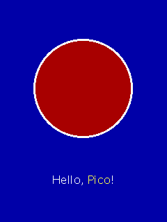

`qg4p_hello` · [`hello.c`](../../examples/hello.c) · screen A

The smallest program that puts something on a screen. Three steps, and two of them are one line:

```c
board_init();                                          /* bus and screen A, from board.h */
qg_cls(s, QG_BLUE);
qg_circle_pct(s, 50, 40, 30, QG_WHITE, QG_RED);
qg_print_align(s, 250, "Hello, {c:YELLOW}Pico{c:}!", QG_ALIGN_CENTER);
```

If this works, your wiring works, and everything after this is just drawing. If it doesn't, [troubleshooting](06-troubleshooting.md) starts with exactly this situation.

**Try:** change the colours; move the circle with different percentages.

<br clear="right">

---

## 2. Shapes

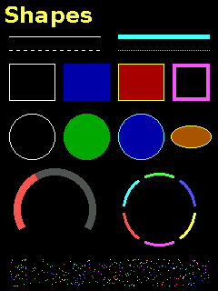

`qg4p_shapes` · [`shapes.c`](../../examples/shapes.c) · screen A

Every drawing primitive on one screen: thin, thick, dashed and dotted lines; boxes as outlines, filled, both and thick; circles and an ellipse; a gauge-like arc and a ring of slices; a sprinkle of points.

The one rule worth remembering: shapes take an outline colour and a fill colour, and **`QG_TRANSPARENT` means "not this part"**.

**Try:** thicker outlines; your own dash patterns (`0xF000` is a long dash with a long gap).

<br clear="right">

---

## 3. Text

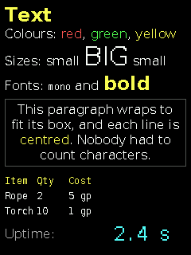

`qg4p_text` · [`text.c`](../../examples/text.c) · screen A

Fonts, the print cursor, markup (`{c:RED}`, `{s:2}`, `{f:1}`), a paragraph wrapped and centred in a box, a tab-aligned table, and an uptime counter that updates in place.

The counter is worth a look: **opaque** text, in a **monospaced** font. Opaque text paints its own background, so each new number covers the old one with no flicker; monospaced means every character, spaces included, is the same width, so a short number fully covers a long one.

**Try:** the counter in the proportional font (drop the `{f:2}`) and watch the old digits' edges peek out. Then put it back.

<br clear="right">

---

## 4. Layout

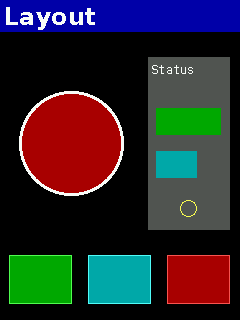 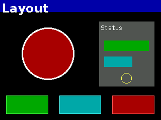

`qg4p_layout` · [`layout.c`](../../examples/layout.c) · screen A

One layout, written in percentages, that fits the screen upright and sideways; the program turns the screen every few seconds to prove it isn't cheating. The status panel on the right is drawn inside a [view](reference/drawing.md#qg_view) with its origin moved, so the panel's own drawing code measures percentages of the **panel** and has no idea where it is.

**Try:** move the panel by changing only the `qg_view_pct` line.

<br clear="right">

---

## 5. Images

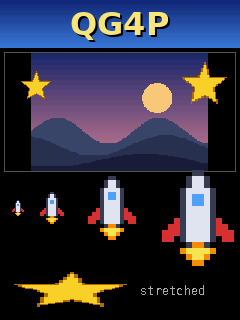

`qg4p_images` · [`images.c`](../../examples/images.c) · screen A

Images compiled into the program: a logo at its own size, a scene fitted into a box, see-through stars on top of it, pixel art scaled 1x, 2x, 4x and 6x (whole numbers keep it crisp), and a star stretched out of shape on purpose.

The art is drawn from scratch by [`examples/art/make_art.py`](../../examples/art/make_art.py) and converted by [`img2bmp8.py`](05-tools.md#img2bmp8py) into `example_art.c`.

**Try:** convert a PNG of your own and draw it (the recipe is at the top of `images.c`).

<br clear="right">

---

## 6. Two screens

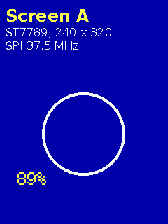 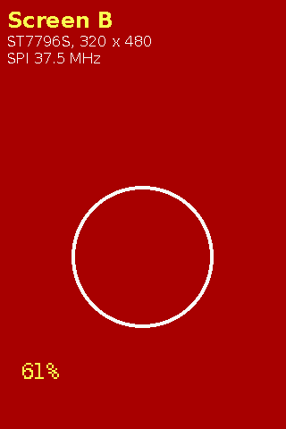

`qg4p_two_screens` · [`two_screens.c`](../../examples/two_screens.c) · screens A and B

Two screens with different chips on one SPI bus, each reporting its chip, size and speed, while their backlights breathe in turn. Every drawing call names its screen, so the library knows which one to talk to; you never select a screen yourself.

**Try:** give each screen a different rotation.

<br clear="right">

---

## 7. Asset pack

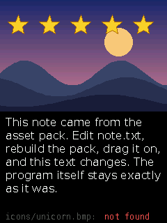 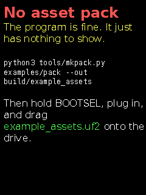

`qg4p_asset_pack` · [`asset_pack.c`](../../examples/asset_pack.c) · screen A · links `qa4p`

Images and text loaded **by name** from an asset pack, which lives in flash separately from the program. The pack is read by QA4P, the asset library, and drawn by QG4P. Build and load the pack first:

```
python3 tools/mkpack.py examples/pack --out build/example_assets
```

then drag `build/example_assets.uf2` onto the Pico in BOOTSEL mode. Run it before loading the pack to see the polite "no pack" screen (right), which is also how your own programs should handle a missing pack.

**Try:** edit `examples/pack/text/note.txt`, rebuild and reload only the pack. The program doesn't change; the screen does.

<br clear="right">

---

## 8. Animation, direct

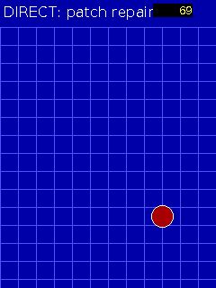

`qg4p_animation_direct` · [`animation_direct.c`](../../examples/animation_direct.c) · screen A

A ball bouncing over a grid, **without** a framebuffer. On a DIRECT screen everything drawn appears at once, so to move the ball you erase it and draw it again. The trick is erasing only the patch it left: set a [view](reference/drawing.md#qg_view) around the old ball, redraw the whole background (the view cuts away everything outside the patch), reset the view, draw the ball.

The eye can still catch the moment between "erased" and "drawn" as a slight flicker. Example 9 makes it go away.

<br clear="right">

---

## 9. Framebuffer

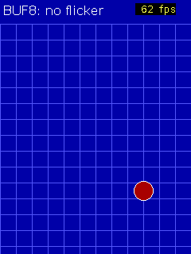

`qg4p_framebuffer` · [`framebuffer.c`](../../examples/framebuffer.c) · screen A (framebuffer)

The same ball, flicker-free. The differences from example 8 are exactly two:

```c
board_init_fb(fb, sizeof fb);       /* 1. a framebuffer: one byte per pixel of RAM */
...
qg_screen_flush(s);                 /* 2. show the finished frame                  */
```

Nothing reaches the glass until the flush, so the half-drawn moment never shows. The flush sends only the rectangle that changed, which is why it's quick. The corner shows frames per second.

**Try:** load example 8, then this one, and watch the ball.

<br clear="right">

---

## 10. Palette effects

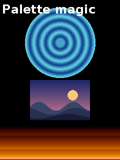

`qg4p_palette_effects` · [`palette_effects.c`](../../examples/palette_effects.c) · screen A (framebuffer)

Rippling water and rising fire that move without redrawing a single pixel. Each ring and band is drawn once in its own palette entry; every frame changes which colour each entry holds, and the flush shows everything in its new colour. The Amiga and VGA crowd did this for waterfalls in 1990 and felt very clever. They were.

The scene in the middle is shown in its **exact** colours, using [`qg_palette_load_image`](reference/images.md#qg_palette_load_image).

<br clear="right">

---

## 11. Paint

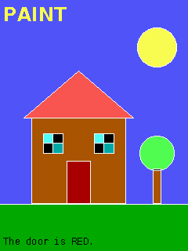

`qg4p_paint` · [`paint.c`](../../examples/paint.c) · screen A (framebuffer)

A colouring book: outlines drawn with lines, boxes and circles, then filled one space at a time with [`qg_paint`](reference/drawing.md#qg_paint), and a colour read back with [`qg_point`](reference/drawing.md#qg_point).

Outlines must be closed. Paint escapes through a one-pixel gap exactly like water, and floods everything. You will do this at least once. Everyone does. It's a rite of passage.

<br clear="right">

---

## 12. Sprites

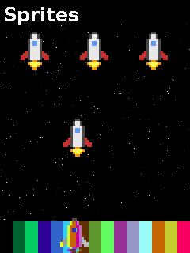

`qg4p_sprites` · [`sprites.c`](../../examples/sprites.c) · screen A (framebuffer)

Three sprite techniques from the golden age of home computers, all with [GET and PUT](reference/blocks.md):

1. **Stamping:** PUT with `QG_PUT_TRANSPARENT` copies the sprite, skipping see-through pixels.
2. **XOR:** PUT with `QG_PUT_XOR` draws it; the same PUT again erases it, exactly, with nothing saved. The catch: over a busy background the colours scramble. (That shimmer was a feature in 1983.)
3. **Save-under:** GET the background first, PUT the sprite, later PUT the saved background back. Correct colours, one extra buffer.

<br clear="right">

---

## 13. Dashboard

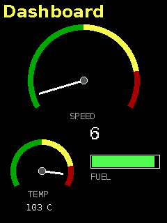

`qg4p_dashboard` · [`dashboard.c`](../../examples/dashboard.c) · screen A

An instrument panel on a DIRECT screen: arc gauges with coloured zones and moving needles, readouts that update in place, and a bar meter. Nothing flickers much, because each frame touches only what moved: a needle is erased by drawing it again in the background colour, and readouts are opaque monospaced text.

One lesson hides in the layout: erasing a needle also erases whatever it crossed, so the labels sit where the needles can't reach.

<br clear="right">

---

## 14. Dice roller

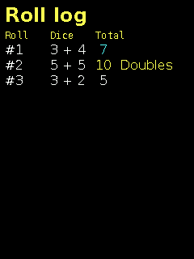 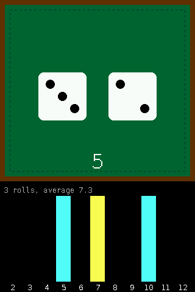

`qg4p_dice_roller` · [`dice_roller.c`](../../examples/dice_roller.c) · screens A and B (B as a framebuffer)

The project QG4P was born from, reduced to its happiest essentials. On screen B, two dice tumble across a felt table: drawn entirely with shapes, squashed as they spin, faces flickering, bouncing lower each time until they land. A histogram of every total so far sits underneath. Screen A keeps a tab-aligned log, with doubles, snake eyes and boxcars called out.

It rolls itself every few seconds; to roll on demand, wire a button from a GPIO to GND and set `ROLL_BUTTON_PIN`.

<br clear="right">

---

## 15. Colour check

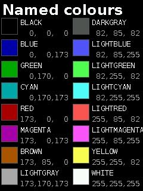 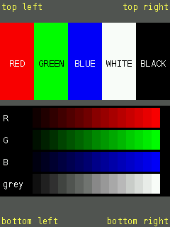

`qg4p_colour_check` · [`colour_check.c`](../../examples/colour_check.c) · screen A (or both)

A test pattern for "is it the panel, my settings, or my camera?" arguments: the 16 named colours with their RGB values; boxes labelled with what they **should** be; smooth ramps; a label in each corner. Compare with the pictures here and read [Help, my red looks blue](06-troubleshooting.md#help-my-red-looks-blue). Set `BOTH_SCREENS` to 1 to compare two panels side by side.

<br clear="right">

---

## 16. Calibrate

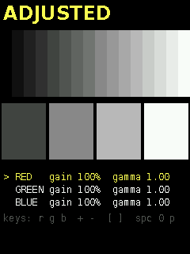 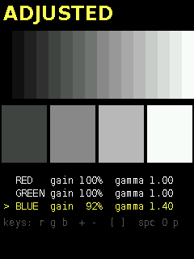

`qg4p_calibrate` · [`calibrate.c`](../../examples/calibrate.c) · screen A (or B)

Tunes a panel's colours live, from the USB serial monitor, until the grey ramp looks grey. Keys: `r` `g` `b` choose a channel; `+` `-` its gamma (mid-tones); `[` `]` its gain (full brightness); space flips between raw and adjusted; `p` prints the lines for `board.h`. Set `CALIBRATE_B` to 1 for screen B.

Look at the ramp straight on, in the light the device will live in, next to a sheet of white paper if you have one. On a cheap panel, the right numbers depend on the viewing angle, so use the one you'll use. The right picture shows blue's gamma raised and its gain lowered: warmer greys, which is the fix for a panel that runs blue.

<br clear="right">
