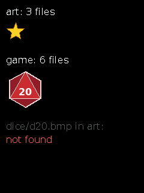

# Asset packs

[open](#qa_open) · [find](#qa_find) · [count and get](#qa_count) · [size](#qa_size) · [verify](#qa_verify) · [error text](#qa_err_str) · [open at](#qa_open_at) · [two packs at once](#two-packs-at-once)

Header: `qa4p.h` · Library: `qa4p` (QuickAssets 4 Pico: separate from `qg4p`, in its own `qa4p/` folder; copy that folder too, and link both).

An **asset pack** is a bundle of files (images, text, anything) built on your PC by `tools/mkpack.py` and loaded into the Pico's flash separately from your program. Your program then finds files by name. Changing the art means rebuilding the pack, not the program. Files are used where they sit in flash: nothing is copied into RAM.

Build and load a pack (see [tools](../05-tools.md#mkpackpy)):
```
python3 tools/mkpack.py my_assets --out build/assets
```
then hold BOOTSEL, plug in, and drag `build/assets.uf2` onto the drive (or `picotool load build/assets.bin -o 0x10100000`).

**A pack is a handle.** Each pack your program opens is a `qa_pack_t`: a few bytes your program owns, filled in by [`qa_open`](#qa_open) and passed to every other function. The library itself remembers nothing, which is how [several packs can be open at once](#two-packs-at-once). Declare it `static` (or global) so it starts out empty and lasts; a local one needs `= {0}`.

The examples here run with the examples' own pack (`examples/pack`) loaded at 1 MB.

A file in the pack, as `qa_find` hands it over (a `qa_file_t`):

| Field | Meaning |
|---|---|
| `name` | its name, e.g. `"icons/star.bmp"` |
| `data`, `size` | its bytes, in flash |
| `type` | `QA_TYPE_IMAGE`, `_TEXT`, `_SOUND` or `_OTHER` |
| `flags` | `QA_FLAG_TRANSPARENT`: an image to open with `QG_IMAGE_TRANSPARENT` |

---

## qa_open

Finds and checks a pack in flash, `flash_offset` bytes in. Call it once per pack, at start-up.

```c
qa_err_t qa_open(qa_pack_t *pack, uint32_t flash_offset);
```

```c example=qa_open pack
static qa_pack_t art;
if (qa_open(&art, QA_DEFAULT_OFFSET) != QA_OK) {
    qg_print_at(&scr, 10, 10, "No asset pack", QG_LIGHTRED, NULL);
} else {
    qg_print_at(&scr, 10, 10, "Asset pack ready", QG_LIGHTGREEN, NULL);
}
```


| Returns | |
|---|---|
| `QA_OK` | ready |
| `QA_ERR_NO_PACK` | no pack there (never loaded, erased, or loaded at a different offset) |
| `QA_ERR_VERSION` | a pack from a newer `mkpack.py` |
| `QA_ERR_CORRUPT` | a damaged pack |
| `QA_ERR_OVERLAP` | your program has grown into the pack's space |
| `QA_ERR_TOO_BIG` | the pack runs past the end of flash |
| `QA_ERR_NOT_READY` | `pack` is `NULL` |

**Notes:** `QA_DEFAULT_OFFSET` is 1 MB, the same as `mkpack.py`'s default `--offset`: a convenient place, not a rule. Any offset works if the program and `mkpack.py` agree. Quick: it checks the pack's header and every file entry, but not every byte (that's [`qa_verify`](#qa_verify)). On any error the pack is left closed, and every other function refuses it with `QA_ERR_NOT_READY`. A missing pack isn't a crash: show a message, as the [asset pack example](../03-examples.md#7-asset-pack) does.

---

## qa_find

Finds a file by name.

```c
qa_err_t qa_find(const qa_pack_t *pack, const char *name, qa_file_t *out);
```

```c example=qa_find pack
static qa_pack_t art;
qa_open(&art, QA_DEFAULT_OFFSET);
qa_file_t f;
if (qa_find(&art, "art/scene.bmp", &f) == QA_OK) {
    qg_image_t img;
    qg_image_open(&img, f.data, f.size,
                  (f.flags & QA_FLAG_TRANSPARENT) ? QG_IMAGE_TRANSPARENT : 0);
    qg_image_draw(&scr, &img, 0, 80);
}
```


| Returns | |
|---|---|
| `QA_OK` | found; `out` describes it |
| `QA_ERR_NOT_FOUND` | no such file |
| `QA_ERR_NOT_READY` | the pack isn't open ([`qa_open`](#qa_open) hasn't succeeded) |

**Notes:** names are as in the folder you packed, with `/` between folders; images converted from PNG, JPG or GIF end in `.bmp`. A lookup takes about a microsecond. Text files aren't followed by a `'\0'`, so copy one into a buffer (adding the `'\0'`) before printing it.

---

## qa_count

How many files are in the pack, and the file at each position (in name order): for listings.

```c
uint16_t qa_count(const qa_pack_t *pack);
qa_err_t qa_get(const qa_pack_t *pack, uint16_t i, qa_file_t *out);
```

```c example=qa_count pack
static qa_pack_t art;
qa_open(&art, QA_DEFAULT_OFFSET);
qg_locate(&scr, 6, 6);
for (uint16_t i = 0; i < qa_count(&art); i++) {
    qa_file_t f;
    qa_get(&art, i, &f);
    qg_println(&scr, f.name);
}
```


**Notes:** `qa_count` is 0 for a pack that isn't open, so the loop above simply does nothing without one.

---

## qa_size

The pack's total size in bytes (0 if it isn't open).

```c
uint32_t qa_size(const qa_pack_t *pack);
```

```c example=qa_size pack
static qa_pack_t art;
char text[40];
qa_open(&art, QA_DEFAULT_OFFSET);
snprintf(text, sizeof text, "%u files, %lu bytes", qa_count(&art),
         (unsigned long)qa_size(&art));
qg_print_at(&scr, 10, 10, text, QG_WHITE, NULL);
```


---

## qa_verify

Checks every byte of the pack against its checksum, to catch a damaged or half-written pack.

```c
qa_err_t qa_verify(const qa_pack_t *pack);
```

```c example=qa_verify pack
static qa_pack_t art;
qa_open(&art, QA_DEFAULT_OFFSET);
qa_err_t e = qa_verify(&art);
qg_print_at(&scr, 10, 10, e == QA_OK ? "Pack checks out" : qa_err_str(e),
            QG_WHITE, NULL);
```


**Notes:** reads the whole pack, about 0.2 seconds per MB, so call it once at start-up if you want it. It's also the only function that needs the 1 KB checksum table; programs that don't call it don't carry it.

---

## qa_err_str

A short description of an error, for messages.

```c
const char *qa_err_str(qa_err_t err);
```

```c example=qa_err_str pack
static qa_pack_t art;
qa_open(&art, QA_DEFAULT_OFFSET);
qa_file_t f;
qa_err_t e = qa_find(&art, "icons/unicorn.bmp", &f);
qg_print_at(&scr, 10, 10, qa_err_str(e), QG_LIGHTRED, NULL);
```


---

## qa_open_at

[`qa_open`](#qa_open) for a pack at any address: in RAM, or compiled into your program as an array.

```c
qa_err_t qa_open_at(qa_pack_t *pack, const uint8_t *addr);
```

```c example=qa_open_at compile-only
extern const uint8_t my_level_pack[];            /* e.g. a pack compiled in as an array */
static qa_pack_t level;
qa_open_at(&level, my_level_pack);
```

**Notes:** it makes none of `qa_open`'s flash checks (overlap, end of flash), since the pack may not be in flash at all. Everything else is the same: once open, use the pack with `qa_find` and the rest.

---

## Two packs at once

Each open pack is its own `qa_pack_t`, so a program can keep several: one for pictures and one for sound, say, or one per game level. Every lookup says which pack to look in, and each pack has only its own files.

```c example=qa_two_packs pack
static qa_pack_t art, game;
qa_file_t f;
qg_image_t img;
char text[40];

qa_open(&art,  QA_DEFAULT_OFFSET);          /* the first pack, at 1 MB   */
qa_open(&game, 0x280000);                   /* a second pack, at 2.5 MB  */

snprintf(text, sizeof text, "art: %u files", qa_count(&art));
qg_print_at(&scr, 10, 10, text, QG_WHITE, NULL);
if (qa_find(&art, "icons/star.bmp", &f) == QA_OK) {
    qg_image_open(&img, f.data, f.size,
                  (f.flags & QA_FLAG_TRANSPARENT) ? QG_IMAGE_TRANSPARENT : 0);
    qg_image_draw(&scr, &img, 10, 36);
}

snprintf(text, sizeof text, "game: %u files", qa_count(&game));
qg_print_at(&scr, 10, 90, text, QG_WHITE, NULL);
if (qa_find(&game, "dice/d20.bmp", &f) == QA_OK) {
    qg_image_open(&img, f.data, f.size,
                  (f.flags & QA_FLAG_TRANSPARENT) ? QG_IMAGE_TRANSPARENT : 0);
    qg_image_draw(&scr, &img, 10, 116);
}

/* The die is in the game pack, not the art pack. */
qa_err_t e = qa_find(&art, "dice/d20.bmp", &f);
qg_print_at(&scr, 10, 200, "dice/d20.bmp in art:", QG_DARKGRAY, NULL);
qg_print_at(&scr, 10, 222, qa_err_str(e), QG_LIGHTRED, NULL);
```


Here the second pack is the hardware tests' pack (`tests/hardware/pack`). Each pack is built and loaded on its own, at its own offset:

```
python3 tools/mkpack.py art  --out build/art                      # 1 MB, the default
python3 tools/mkpack.py game --out build/game --offset 0x280000   # 2.5 MB
picotool load build/game.bin -o 0x10280000
```

**Notes:** packs must not overlap. `qa_open` checks each pack against your program and the end of flash, but it can't know about your other packs: that part is up to you. `mkpack.py` prints the flash range each pack takes, so you can check, and [`docs/RESOURCES.md`](../../RESOURCES.md#flash-plan) has the plan the QM4P libraries follow (pictures from 1 MB, sound from 2.5 MB).
