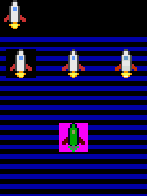
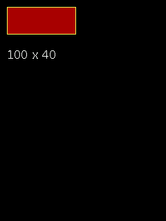

# GET and PUT

[GET](#qg_get) · [PUT](#qg_put) · [block size](#qg_block_width) · [QG_BLOCK_BYTES](#qg_block_bytes)

Header: `qg_block.h` (included by `qg4p.h`).

QuickBasic's sprite system: copy a rectangle of the screen into memory with **GET**, stamp it anywhere with **PUT**. A block is plain bytes: a 4-byte header (width, height), then one palette number per pixel, row by row.

---

## QG_BLOCK_BYTES

How many bytes a block of a given size needs.

```c
#define QG_BLOCK_BYTES(w, h)      /* 4 + w * h */
```

```c example=block_bytes compile-only
static uint8_t sprite[QG_BLOCK_BYTES(32, 16)];    /* room for a 32 x 16 block: 516 bytes */
```

---

## qg_get

Copies a rectangle of the screen into memory. **Framebuffer screens only.**

```c
qg_err_t qg_get(qg_screen_t *scr, int16_t x1, int16_t y1, int16_t x2, int16_t y2,
                uint8_t *buf, uint32_t buf_size);
```
QuickBasic: `GET (x1, y1)-(x2, y2), array`

```c example=get buf8
static uint8_t block[QG_BLOCK_BYTES(64, 64)];
qg_image_draw_scaled(&scr, &ship, 0, 0, 64, 64);           /* draw something */
qg_get(&scr, 0, 0, 63, 63, block, sizeof block);           /* GET it */
for (int i = 0; i < 3; i++) {
    qg_put(&scr, (int16_t)(20 + i * 70), 150, block, QG_PUT_PSET);   /* PUT copies */
}
```


| Parameter | Meaning |
|---|---|
| `x1`, `y1`, `x2`, `y2` | the rectangle's corners, both included, any order |
| `buf`, `buf_size` | where to put it, at least `QG_BLOCK_BYTES(width, height)` bytes |
| **returns** | `QG_OK`; `QG_ERR_UNSUPPORTED` on a DIRECT screen; `QG_ERR_ARG` if the rectangle isn't entirely inside the screen (or view), or `buf` is too small |

**Notes:** a DIRECT screen keeps no copy of its pixels, so there's nothing to GET. You can still build a block by hand, or draw it on a framebuffer screen.
**See also:** [`qg_put`](#qg_put)

---

## qg_put

Stamps a block at `(x, y)`, combining it with the screen in one of six ways.

```c
qg_err_t qg_put(qg_screen_t *scr, int16_t x, int16_t y, const uint8_t *buf, qg_put_t mode);
```
QuickBasic: `PUT (x, y), array, mode`

```c example=put buf8
static uint8_t block[QG_BLOCK_BYTES(48, 48)], cut[QG_BLOCK_BYTES(48, 48)];
qg_image_draw_scaled(&scr, &ship, 0, 0, 48, 48);
qg_get(&scr, 0, 0, 47, 47, block, sizeof block);
for (uint32_t i = 0; i < sizeof block; i++)            /* black -> see-through */
    cut[i] = (i >= 4 && block[i] == QG_BLACK) ? 255 : block[i];
for (int16_t y = 60; y < 320; y += 16)                  /* a stripy background */
    qg_box(&scr, 0, y, 239, (int16_t)(y + 7), QG_TRANSPARENT, QG_BLUE);
qg_put(&scr, 10, 80, block, QG_PUT_PSET);               /* the whole square       */
qg_put(&scr, 96, 80, cut, QG_PUT_TRANSPARENT);          /* just the ship          */
qg_put(&scr, 182, 80, block, QG_PUT_XOR);               /* XOR: colours scramble  */
qg_put(&scr, 96, 200, block, QG_PUT_PRESET);            /* inverted               */
```


| Parameter | Meaning |
|---|---|
| `x`, `y` | where the block's top-left corner goes; partly off the screen is fine (it's cut off) |
| `buf` | a block from [`qg_get`](#qg_get) (or made by hand) |
| `mode` | how it combines with what's there (below) |
| **returns** | `QG_OK`; `QG_ERR_UNSUPPORTED` for AND, OR or XOR on a DIRECT screen; `QG_ERR_ARG` for a missing block |

| Mode | Result | Screens |
|---|---|---|
| `QG_PUT_PSET` | the block, exactly | any |
| `QG_PUT_PRESET` | the block with every number inverted (255 − n) | any |
| `QG_PUT_TRANSPARENT` | the block, skipping 255 (see-through) | any |
| `QG_PUT_AND` | screen AND block, number by number | framebuffer |
| `QG_PUT_OR` | screen OR block | framebuffer |
| `QG_PUT_XOR` | screen XOR block. PUT the same block again, same place, and the screen is **exactly** as it was: the classic way to move a sprite without saving what's underneath | framebuffer |

**Notes:** the bitwise modes work on palette **numbers**, as QuickBasic's did on its colour numbers, so with the standard palette the colours they produce look fairly random. For XOR sprites, give the block a background of 0 (black): anything XOR 0 is unchanged, so the background stays invisible. Results can include number 255, which shows palette entry 255's colour, magenta unless you change it (see [`qg_palette_set`](colour.md#qg_palette_set)): that's the magenta square in the picture, PRESET's inverse of black. Unlike QuickBasic, a PUT hanging off the edge is cut off rather than refused.
**See also:** [`qg_get`](#qg_get), the [sprites example](../03-examples.md#12-sprites)

---

## qg_block_width

A block's size, read from its header.

```c
int16_t qg_block_width(const uint8_t *buf);
int16_t qg_block_height(const uint8_t *buf);
```

```c example=block_width buf8
static uint8_t block[QG_BLOCK_BYTES(100, 40)];
qg_box(&scr, 10, 10, 109, 49, QG_YELLOW, QG_RED);
qg_get(&scr, 10, 10, 109, 49, block, sizeof block);
char text[32];
snprintf(text, sizeof text, "%d x %d", qg_block_width(block), qg_block_height(block));
qg_print_at(&scr, 10, 70, text, QG_WHITE, NULL);
```

