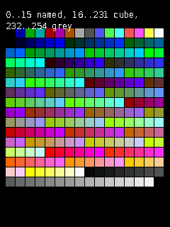
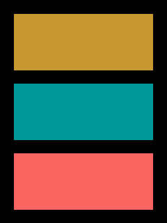
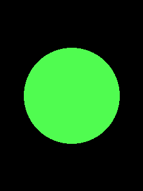
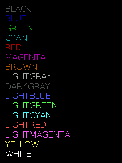
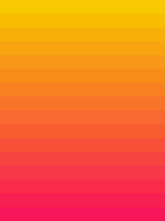
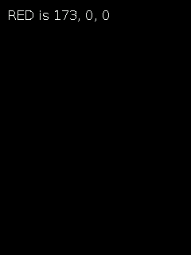
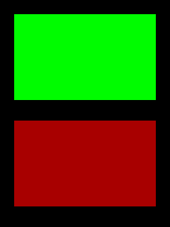
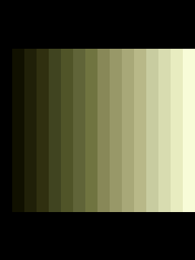

# Colour

[named colours](#the-named-colours) · [special values](#special-values) · [RGB565](#qg_rgb565) · [from RGB](#qg_color_from_rgb) · [from name](#qg_color_from_name) · [name of](#qg_color_name) · [set](#qg_palette_set) · [get](#qg_palette_get) · [reset](#qg_palette_reset) · [standard](#qg_palette_standard) · [colour adjustment](#qg_screen_set_color_adjust)

Header: `qg_palette.h` (included by `qg4p.h`).

A colour in QG4P is a **palette number**, 0 to 255. Each screen has its own palette: a list of 256 colours, which starts as the standard one. Drawing with colour 4 means "whatever colour entry 4 of this screen's palette holds".

The standard palette:

| Entries | Contents |
|---|---|
| 0 to 15 | the 16 named colours (QuickBasic's) |
| 16 to 231 | a 6 x 6 x 6 colour cube: every mix of 6 levels of red, green and blue |
| 232 to 254 | a grey ramp |
| 255 | reserved: means "see-through" |



## The named colours

| | | | |
|---|---|---|---|
| `QG_BLACK` 0 | `QG_BLUE` 1 | `QG_GREEN` 2 | `QG_CYAN` 3 |
| `QG_RED` 4 | `QG_MAGENTA` 5 | `QG_BROWN` 6 | `QG_LIGHTGRAY` 7 |
| `QG_DARKGRAY` 8 | `QG_LIGHTBLUE` 9 | `QG_LIGHTGREEN` 10 | `QG_LIGHTCYAN` 11 |
| `QG_LIGHTRED` 12 | `QG_LIGHTMAGENTA` 13 | `QG_YELLOW` 14 | `QG_WHITE` 15 |

They're QuickBasic's colours, including its softer red (170, 0, 0) and pale yellow (255, 255, 85). For pure colours, use [`qg_color_from_rgb`](#qg_color_from_rgb).

## Special values

| Value | Meaning |
|---|---|
| `QG_TRANSPARENT` (255) | "don't draw this": no fill, no outline, see-through text background |
| `QG_DEFAULT` | "use the default": the screen's foreground colour (or background, for `qg_cls`) |
| `QG_NONE` | "no colour": what [`qg_point`](drawing.md#qg_point) returns when it can't read a pixel |

This is why `qg_color_t` is 16 bits for an 8-bit palette number: room for `QG_DEFAULT` and `QG_NONE`.

```c example=palette_chart
for (int i = 0; i < 256; i++) {                   /* the standard palette, 16 x 16 */
    int16_t x = (int16_t)(8 + (i % 16) * 14), y = (int16_t)(40 + (i / 16) * 14);
    qg_box(&scr, x, y, (int16_t)(x + 12), (int16_t)(y + 12), QG_TRANSPARENT, (qg_color_t)(i == 255 ? QG_BLACK : i));
}
qg_print_at(&scr, 8, 10, "{f:2}0..15 named, 16..231 cube, 232..254 grey", QG_WHITE, NULL);
```

---

## QG_RGB565

Packs red, green and blue (0 to 255 each) into the 16-bit form the screens use.

```c
#define QG_RGB565(r, g, b)
```

```c example=rgb565 compile-only
uint16_t orange = QG_RGB565(255, 128, 0);        /* 0xFC00 */
```

**Notes:** RGB565 keeps 5 bits of red, 6 of green and 5 of blue, so values are rounded. You'll rarely need it: palettes are set with [`qg_palette_set`](#qg_palette_set), which takes plain RGB.

---

## qg_color_from_rgb

Finds the palette colour closest to an RGB colour.

```c
qg_color_t qg_color_from_rgb(uint8_t r, uint8_t g, uint8_t b, const uint16_t *palette);
```

```c example=color_from_rgb
qg_color_t gold  = qg_color_from_rgb(212, 175, 55, scr.palette);
qg_color_t teal  = qg_color_from_rgb(0, 128, 128, scr.palette);
qg_color_t coral = qg_color_from_rgb(255, 127, 80, scr.palette);
qg_box(&scr, 20, 20, 219, 100, QG_TRANSPARENT, gold);
qg_box(&scr, 20, 120, 219, 200, QG_TRANSPARENT, teal);
qg_box(&scr, 20, 220, 219, 300, QG_TRANSPARENT, coral);
```


| Parameter | Meaning |
|---|---|
| `r`, `g`, `b` | the colour you want, 0 to 255 each |
| `palette` | the palette to search: `scr.palette`, or `NULL` for the standard palette |
| **returns** | the nearest entry, 0 to 254 (never `QG_TRANSPARENT`) |

**Notes:** it searches all 255 entries, so do it once, at start-up, and keep the result. "Nearest" weighs green most and blue least, roughly as the eye does. For an exact colour, set a palette entry with [`qg_palette_set`](#qg_palette_set).

---

## qg_color_from_name

Looks up one of the 16 named colours by name.

```c
int qg_color_from_name(const char *name, size_t len);
```

```c example=color_from_name
int c = qg_color_from_name("lightgreen", 10);          /* any case */
if (c >= 0) qg_circle(&scr, 120, 160, 80, QG_TRANSPARENT, (qg_color_t)c);
```


| Parameter | Meaning |
|---|---|
| `name`, `len` | the name and its length (so it can point into a longer string) |
| **returns** | 0 to 15, or -1 if it isn't one of the 16 names |

---

## qg_color_name

The name of a named colour.

```c
const char *qg_color_name(qg_color_t c);
```

```c example=color_name
for (int i = 0; i < 16; i++) {
    qg_print_at(&scr, 10, (int16_t)(8 + i * 19), qg_color_name((qg_color_t)i),
                i ? (qg_color_t)i : QG_DARKGRAY, NULL);
}
```


| Returns | |
|---|---|
| a name | `"RED"`, `"LIGHTCYAN"` and so on, for 0 to 15 |
| `NULL` | for anything else |

---

## qg_palette_set

Changes one of a screen's palette entries.

```c
qg_err_t qg_palette_set(qg_screen_t *scr, qg_color_t index, uint8_t r, uint8_t g, uint8_t b);
```

```c example=palette_set
for (int i = 0; i < 16; i++) {                     /* entries 160..175: a sunset ramp */
    qg_palette_set(&scr, (qg_color_t)(160 + i), 255, (uint8_t)(200 - i * 12), (uint8_t)(i * 6));
    qg_box(&scr, 0, (int16_t)(i * 20), 239, (int16_t)(i * 20 + 19), QG_TRANSPARENT, (qg_color_t)(160 + i));
}
```


| Parameter | Meaning |
|---|---|
| `index` | 0 to 255 |
| `r`, `g`, `b` | the new colour, 0 to 255 each |
| **returns** | `QG_OK`, or `QG_ERR_ARG` for a missing screen or an index above 255 |

**Notes:** on a **DIRECT** screen, only what you draw afterwards uses the new colour. On a **framebuffer** screen, everything already drawn with that entry changes colour at the next flush: that's palette animation (see the [palette effects example](../03-examples.md#10-palette-effects)). Entry 255 can be set, but nothing draws with it as a colour; it only shows where [bitwise PUT](blocks.md#qg_put) leaves the number 255.

---

## qg_palette_get

Reads a palette entry back as red, green and blue.

```c
void qg_palette_get(const uint16_t *palette, qg_color_t index, uint8_t *r, uint8_t *g, uint8_t *b);
```

```c example=palette_get
uint8_t r, g, b;
char text[40];
qg_palette_get(scr.palette, QG_RED, &r, &g, &b);
snprintf(text, sizeof text, "RED is %u, %u, %u", r, g, b);
qg_print_at(&scr, 10, 10, text, QG_WHITE, NULL);
```


**Notes:** the values are as the screen stores them, rounded by RGB565: QuickBasic's red (170, 0, 0) reads back as (173, 0, 0). With a [colour adjustment](#qg_screen_set_color_adjust) set, this is still the colour you asked for, not the adjusted one sent to the panel.

---

## qg_palette_reset

Puts a screen's palette back to the standard one.

```c
void qg_palette_reset(qg_screen_t *scr);
```

```c example=palette_reset
qg_palette_set(&scr, QG_RED, 0, 255, 0);            /* "red" is now green... */
qg_box(&scr, 20, 20, 219, 140, QG_TRANSPARENT, QG_RED);
qg_palette_reset(&scr);                             /* ...and red again */
qg_box(&scr, 20, 170, 219, 290, QG_TRANSPARENT, QG_RED);
```


---

## qg_palette_standard

The standard palette, for reading (or copying into palettes of your own).

```c
const uint16_t *qg_palette_standard(void);
void qg_palette_copy_standard(uint16_t dst[256]);
```

```c example=palette_standard compile-only
qg_color_t c = qg_color_from_rgb(212, 175, 55, qg_palette_standard());   /* same as passing NULL */
static uint16_t mine[256];
qg_palette_copy_standard(mine);
```

---

## qg_screen_set_color_adjust

Corrects a panel whose colours are a little off: a brightness (gain) and a mid-tone curve (gamma) for each of red, green and blue.

```c
qg_err_t qg_screen_set_color_adjust(qg_screen_t *scr, const qg_color_adjust_t *adj,
                                    qg_color_adjust_state_t *state);
```

```c example=color_adjust
static qg_color_adjust_state_t tables;                  /* 1,290 bytes: yours */
qg_color_adjust_t warmer = { .gain = { 100, 100, 85 }, .gamma = { 100, 100, 140 } };
qg_screen_set_color_adjust(&scr, &warmer, &tables);     /* this screen only */
for (int i = 0; i < 16; i++) {                          /* a grey ramp, now warmer */
    uint8_t v = (uint8_t)(i * 17);
    qg_palette_set(&scr, (qg_color_t)(160 + i), v, v, v);
    qg_box(&scr, (int16_t)(i * 15), 60, (int16_t)(i * 15 + 14), 260, QG_TRANSPARENT, (qg_color_t)(160 + i));
}
```


| Parameter | Meaning |
|---|---|
| `adj` | the settings, or `NULL` to switch adjustment off. `gain[3]`: percent, 0 to 100, how bright full intensity is (lower one to take a tint out of white). `gamma[3]`: x 100, 50 to 300, bends the mid-tones (higher = darker mid-tones for that colour); 100 leaves them alone |
| `state` | the working tables: a `qg_color_adjust_state_t` you declare, one per adjusted screen, kept for as long as the adjustment is on |
| **returns** | `QG_OK`; `QG_ERR_ARG` for missing `state`, a gain over 100, or a gamma outside 50 to 300 |

**Notes:** applies to everything the screen sends, where colours leave for the panel; everything else (`qg_palette_get`, `qg_color_from_rgb`) still sees the colours you asked for. No cost per pixel. On a framebuffer screen the next flush shows the change; on a DIRECT screen, redraw. Screens you don't adjust carry no tables. To find the numbers for a panel, run the [calibrate example](../03-examples.md#16-calibrate). `QG_COLOR_ADJUST_NONE` is all 100s.
