# Drawing

[CLS](#qg_cls) · [PSET](#qg_pset) · [PRESET](#qg_preset) · [LINE](#qg_line) · [box](#qg_box) · [CIRCLE](#qg_circle) · [ellipse](#qg_ellipse) · [arc](#qg_arc) · [line width](#qg_screen_set_line_width) · [line style](#qg_screen_set_line_style) · [COLOR](#qg_screen_set_colors) · [POINT](#qg_point) · [PAINT](#qg_paint) · [VIEW](#qg_view) · [view reset](#qg_view_reset) · [view size](#qg_view_width)

Header: `qg_draw.h` (included by `qg4p.h`). Percentage versions of these are in [percentages](percentages.md).

**True of every drawing function:**
- The first argument is the screen to draw on: `&scr`.
- Coordinates are pixels, `(0, 0)` at the top left. Anything off the screen (or outside a [view](#qg_view)) is simply cut off; negative and oversized coordinates are fine.
- Colours are palette numbers: `QG_RED`, `200`, or anything from [`qg_color_from_rgb`](colour.md#qg_color_from_rgb). `QG_DEFAULT` means the screen's foreground colour (see [`qg_screen_set_colors`](#qg_screen_set_colors)). `QG_TRANSPARENT` means "don't draw this part".
- Shapes take a **stroke** (outline) and a **fill** colour. Outline only: fill `QG_TRANSPARENT`. Filled only: stroke `QG_TRANSPARENT`.

Every example on this page draws on a 240x320 screen called `scr`.

---

## qg_cls

Clears the screen (or the [view](#qg_view)) to one colour, and moves the print cursor home.

```c
void qg_cls(qg_screen_t *scr, qg_color_t color);
```
QuickBasic: `CLS`

```c example=cls
qg_cls(&scr, QG_BLUE);
```
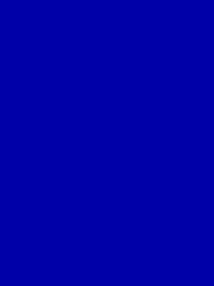

| Parameter | Meaning |
|---|---|
| `color` | the colour to clear to; `QG_DEFAULT` = the screen's background colour |

**Notes:** with a [view](#qg_view) set, only the view is cleared. Also forgets the lines remembered for [text scrolling](text.md#scrolling).
**See also:** [`qg_screen_set_colors`](#qg_screen_set_colors), [`qg_locate`](text.md#qg_locate)

---

## qg_pset

Sets one pixel.

```c
void qg_pset(qg_screen_t *scr, int16_t x, int16_t y, qg_color_t color);
```
QuickBasic: `PSET (x, y), color`

```c example=pset
for (int16_t x = 20; x < 220; x += 4) {
    qg_pset(&scr, x, (int16_t)(160 - (x - 120) * (x - 120) / 80), QG_YELLOW);
}
```
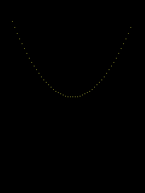

| Parameter | Meaning |
|---|---|
| `x`, `y` | the pixel |
| `color` | its colour; `QG_DEFAULT` = the foreground colour |

**Notes:** drawing many pixels one at a time is the slowest way to draw. For lines, boxes and circles, use those functions: they send whole runs at once.
**See also:** [`qg_preset`](#qg_preset), [`qg_point`](#qg_point)

---

## qg_preset

Sets one pixel, in the **background** colour unless you give one: the QuickBasic way to erase a point.

```c
void qg_preset(qg_screen_t *scr, int16_t x, int16_t y, qg_color_t color);
```
QuickBasic: `PRESET (x, y) [, color]`

```c example=preset
for (int16_t x = 20; x < 220; x += 2) qg_pset(&scr, x, 160, QG_LIGHTGREEN);
for (int16_t x = 20; x < 220; x += 8) qg_preset(&scr, x, 160, QG_DEFAULT);   /* gaps */
```
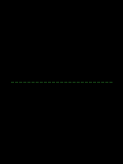

| Parameter | Meaning |
|---|---|
| `x`, `y` | the pixel |
| `color` | `QG_DEFAULT` = the screen's **background** colour; or any colour, like [`qg_pset`](#qg_pset) |

**See also:** [`qg_pset`](#qg_pset), [`qg_screen_set_colors`](#qg_screen_set_colors)

---

## qg_line

Draws a straight line between two points, both included.

```c
void qg_line(qg_screen_t *scr, int16_t x1, int16_t y1,
             int16_t x2, int16_t y2, qg_color_t color);
```
QuickBasic: `LINE (x1, y1)-(x2, y2), color`

```c example=line
qg_line(&scr, 0, 0, 239, 319, QG_YELLOW);           /* corner to corner */
qg_screen_set_line_width(&scr, 6);
qg_line(&scr, 20, 160, 220, 160, QG_LIGHTRED);      /* thick */
qg_screen_set_line_width(&scr, 1);
```
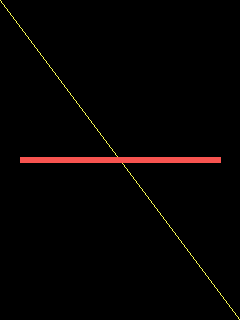

| Parameter | Meaning |
|---|---|
| `x1`, `y1`, `x2`, `y2` | the two ends; either may be off the screen |
| `color` | the line's colour |

**Notes:** thickness comes from [`qg_screen_set_line_width`](#qg_screen_set_line_width) and is centred on the line; the pattern comes from [`qg_screen_set_line_style`](#qg_screen_set_line_style).
**See also:** [`qg_box`](#qg_box), [`qg_line_pct`](percentages.md#qg_line_pct) · **How it works:** [Bresenham's lines](../09-how-it-works.md#lines)

---

## qg_box

Draws a rectangle between two opposite corners: outline, filled, or both.

```c
void qg_box(qg_screen_t *scr, int16_t x1, int16_t y1, int16_t x2, int16_t y2,
            qg_color_t stroke, qg_color_t fill);
```
QuickBasic: `LINE (x1, y1)-(x2, y2), color, B` (outline) or `BF` (filled)

```c example=box
qg_box(&scr, 20, 20, 110, 100, QG_WHITE, QG_TRANSPARENT);    /* outline */
qg_box(&scr, 130, 20, 220, 100, QG_TRANSPARENT, QG_BLUE);    /* filled  */
qg_box(&scr, 20, 120, 110, 200, QG_YELLOW, QG_RED);          /* both    */
qg_screen_set_line_width(&scr, 8);
qg_box(&scr, 130, 120, 220, 200, QG_LIGHTMAGENTA, QG_TRANSPARENT);
qg_screen_set_line_width(&scr, 1);
```
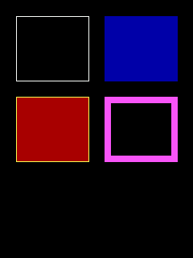

| Parameter | Meaning |
|---|---|
| `x1`, `y1`, `x2`, `y2` | opposite corners, both included, in any order |
| `stroke` | outline colour, or `QG_TRANSPARENT` for none |
| `fill` | inside colour, or `QG_TRANSPARENT` for none |

**Notes:** thick outlines grow **inward**, so the box's outer size never changes with the line width.
**See also:** [`qg_box_pct`](percentages.md#qg_box_pct), [`qg_screen_set_line_style`](#qg_screen_set_line_style)

---

## qg_circle

Draws a circle: outline, filled, or both.

```c
void qg_circle(qg_screen_t *scr, int16_t cx, int16_t cy, int16_t r,
               qg_color_t stroke, qg_color_t fill);
```
QuickBasic: `CIRCLE (x, y), r, color` (plus `PAINT` to fill)

```c example=circle
qg_circle(&scr, 70, 80, 50, QG_WHITE, QG_TRANSPARENT);
qg_circle(&scr, 170, 80, 50, QG_TRANSPARENT, QG_GREEN);
qg_screen_set_line_width(&scr, 6);
qg_circle(&scr, 120, 220, 70, QG_LIGHTCYAN, QG_BLUE);
qg_screen_set_line_width(&scr, 1);
```
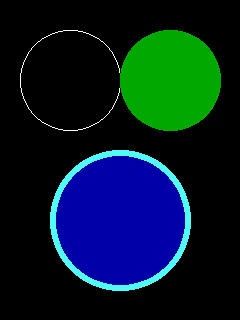

| Parameter | Meaning |
|---|---|
| `cx`, `cy` | the centre |
| `r` | the radius; the circle is `2r + 1` pixels across |
| `stroke`, `fill` | as for [`qg_box`](#qg_box) |

**Notes:** thick outlines grow inward.
**See also:** [`qg_ellipse`](#qg_ellipse), [`qg_arc`](#qg_arc), [`qg_circle_pct`](percentages.md#qg_circle_pct) · **How it works:** [circles and ellipses](../09-how-it-works.md#circles-and-ellipses)

---

## qg_ellipse

Draws an ellipse: a circle stretched to a different width and height.

```c
void qg_ellipse(qg_screen_t *scr, int16_t cx, int16_t cy, int16_t rx, int16_t ry,
                qg_color_t stroke, qg_color_t fill);
```
QuickBasic: `CIRCLE (x, y), r, color, , , aspect`

```c example=ellipse
qg_ellipse(&scr, 120, 90, 100, 40, QG_YELLOW, QG_BROWN);
qg_ellipse(&scr, 120, 220, 40, 80, QG_WHITE, QG_TRANSPARENT);
```
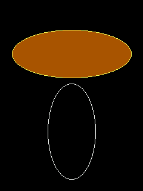

| Parameter | Meaning |
|---|---|
| `cx`, `cy` | the centre |
| `rx`, `ry` | the horizontal and vertical radii |
| `stroke`, `fill` | as for [`qg_box`](#qg_box) |

**See also:** [`qg_circle`](#qg_circle), [`qg_ellipse_pct`](percentages.md#qg_ellipse_pct)

---

## qg_arc

Draws part of a circle's or ellipse's outline.

```c
void qg_arc(qg_screen_t *scr, int16_t cx, int16_t cy, int16_t rx, int16_t ry,
            int16_t start_deg, int16_t end_deg, qg_color_t color);
```
QuickBasic: `CIRCLE (x, y), r, color, start, end` (QuickBasic used radians)

```c example=arc
qg_screen_set_line_width(&scr, 10);
qg_arc(&scr, 120, 110, 80, 80, -30, 210, QG_DARKGRAY);   /* a gauge's track   */
qg_arc(&scr, 120, 110, 80, 80, 120, 210, QG_LIGHTRED);   /* ...partly filled  */
qg_screen_set_line_width(&scr, 3);
qg_arc(&scr, 120, 250, 60, 40, 0, 90, QG_YELLOW);        /* top-right quarter */
qg_screen_set_line_width(&scr, 1);
```
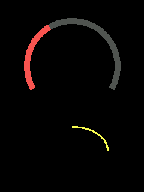

| Parameter | Meaning |
|---|---|
| `cx`, `cy`, `rx`, `ry` | the ellipse it's part of (`rx == ry` for a circle) |
| `start_deg`, `end_deg` | where it starts and ends, in degrees: 0 = 3 o'clock, 90 = 12 o'clock, running **counter-clockwise**. Negative and over-360 values are fine; `start == end` is the whole outline |
| `color` | its colour |

**Notes:** `(0, 90)` is the top-right quarter; `(90, 0)` is the other three quarters. Thick arcs grow inward, like circle outlines.
**See also:** [`qg_circle`](#qg_circle), [`qg_arc_pct`](percentages.md#qg_arc_pct) · **How it works:** [arcs without trigonometry](../09-how-it-works.md#arcs)

---

## qg_screen_set_line_width

Sets how thick lines, outlines and arcs are, in pixels.

```c
void qg_screen_set_line_width(qg_screen_t *scr, uint8_t width);
uint8_t qg_screen_get_line_width(const qg_screen_t *scr);
```

```c example=line_width
for (uint8_t w = 1; w <= 8; w++) {
    qg_screen_set_line_width(&scr, w);
    qg_line(&scr, 20, (int16_t)(w * 34), 220, (int16_t)(w * 34), QG_WHITE);
}
qg_screen_set_line_width(&scr, 1);
```
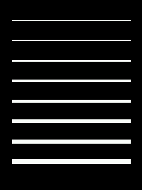

| Parameter | Meaning |
|---|---|
| `width` | 1 or more (0 acts as 1). Stays set until changed; 1 after start-up |

**Notes:** lines are thickened on both sides of their centre; box, circle, ellipse and arc outlines grow inward, so a shape's outer size doesn't change. **Set it back to 1** afterwards if the rest of your drawing expects thin lines.
**See also:** [`qg_screen_set_line_style`](#qg_screen_set_line_style)

---

## qg_screen_set_line_style

Sets a dash pattern for lines and box outlines.

```c
void qg_screen_set_line_style(qg_screen_t *scr, uint16_t pattern);
```
QuickBasic: the `style` argument of `LINE`

```c example=line_style
static const uint16_t styles[] = { 0xF0F0, 0xAAAA, 0xFF18, 0xFFF0 };
for (int i = 0; i < 4; i++) {
    qg_screen_set_line_style(&scr, styles[i]);
    qg_line(&scr, 20, (int16_t)(30 + i * 30), 220, (int16_t)(30 + i * 30), QG_WHITE);
}
qg_screen_set_line_width(&scr, 4);
qg_screen_set_line_style(&scr, 0xF0F0);
qg_box(&scr, 30, 170, 210, 290, QG_YELLOW, QG_TRANSPARENT);
qg_screen_set_line_width(&scr, 1);
qg_screen_set_line_style(&scr, 0xFFFF);           /* solid again */
```
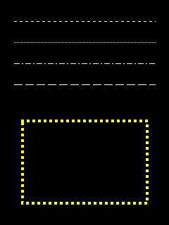

| Parameter | Meaning |
|---|---|
| `pattern` | 16 bits, read from the top bit down: 1 = draw, 0 = skip, repeating every 16 pixels. `0xFFFF` (or 0) = solid, the default |

**Notes:** works at any line width. On a box, the pattern runs once around it, carrying on around the corners. Circles, ellipses and arcs stay solid. **Set it back to `0xFFFF`** when you're done, or everything after is dashed too.
**See also:** [`qg_line`](#qg_line), [`qg_box`](#qg_box)

---

## qg_screen_set_colors

Sets the screen's default foreground and background colours.

```c
void qg_screen_set_colors(qg_screen_t *scr, qg_color_t fg, qg_color_t bg);
```
QuickBasic: `COLOR fg, bg`

```c example=set_colors
qg_screen_set_colors(&scr, QG_YELLOW, QG_BLUE);
qg_cls(&scr, QG_DEFAULT);                         /* clears to the background: blue */
qg_circle(&scr, 120, 140, 60, QG_DEFAULT, QG_TRANSPARENT);   /* foreground: yellow */
qg_print_at(&scr, 60, 230, "Default colours", QG_DEFAULT, NULL);
```
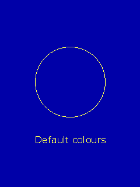

| Parameter | Meaning |
|---|---|
| `fg` | used wherever a drawing or printing call is given `QG_DEFAULT` |
| `bg` | used by `qg_cls(scr, QG_DEFAULT)` and [`qg_preset`](#qg_preset) |

**Notes:** pass `QG_DEFAULT` for either to leave it as it is. After start-up: white on black.

---

## qg_point

Reads the colour of one pixel back. **Framebuffer screens only.**

```c
qg_color_t qg_point(qg_screen_t *scr, int16_t x, int16_t y);
```
QuickBasic: `POINT (x, y)`

```c example=point buf8
qg_box(&scr, 40, 40, 200, 140, QG_TRANSPARENT, QG_GREEN);
qg_color_t c = qg_point(&scr, 100, 100);                  /* QG_GREEN */
qg_print_at(&scr, 40, 180, qg_color_name(c), QG_WHITE, NULL);
```
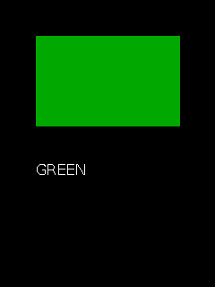

| Parameter | Meaning |
|---|---|
| `x`, `y` | the pixel |
| **returns** | its palette number (0 to 255); `QG_NONE` on a DIRECT screen, or off the screen or view |

**Notes:** a DIRECT screen sends pixels to the panel and keeps no copy, so there's nothing to read back.
**See also:** [`qg_paint`](#qg_paint), [framebuffers](screens.md#framebuffer-screens)

---

## qg_paint

Flood-fills an enclosed area. **Framebuffer screens only.**

```c
qg_err_t qg_paint(qg_screen_t *scr, int16_t x, int16_t y,
                  qg_color_t fill, qg_color_t border);
```
QuickBasic: `PAINT (x, y), fill, border`

```c example=paint buf8
qg_circle(&scr, 120, 120, 80, QG_WHITE, QG_TRANSPARENT);
qg_line(&scr, 40, 120, 200, 120, QG_WHITE);
qg_paint(&scr, 120, 80, QG_RED, QG_WHITE);        /* the top half, up to white */
qg_paint(&scr, 120, 160, QG_BLUE, QG_WHITE);      /* the bottom half */
qg_paint(&scr, 5, 300, QG_DARKGRAY, QG_DEFAULT);  /* recolour the black outside */
```
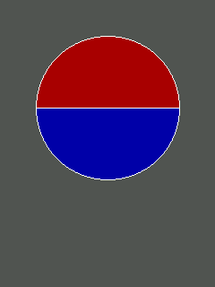

| Parameter | Meaning |
|---|---|
| `x`, `y` | any point inside the area |
| `fill` | the colour to fill with |
| `border` | fill until reaching this colour; or `QG_DEFAULT` for a "bucket fill" of the connected area that has the starting pixel's colour |
| **returns** | `QG_OK`; `QG_ERR_UNSUPPORTED` on a DIRECT screen; `QG_ERR_ARG` if `(x, y)` is off the screen; `QG_ERR_OVERFLOW` if the shape was too intricate for its working list (the fill is then incomplete) |

**Notes:** "connected" means left, right, up or down, so a one-pixel diagonal line still holds paint in. **A single-pixel gap lets it escape** and flood everything. With a border colour, it paints over anything that isn't the border, text included. It stays inside the [view](#qg_view).
**See also:** [`qg_point`](#qg_point), `QG_PAINT_STACK` in [settings](../appendices.md#settings) · **How it works:** [scanline flood fill](../09-how-it-works.md#flood-fill)

---

## qg_view

Restricts all drawing to a rectangle of the screen, optionally making it a little screen of its own.

```c
void qg_view(qg_screen_t *scr, int16_t x1, int16_t y1, int16_t x2, int16_t y2,
             bool move_origin);
```
QuickBasic: `VIEW SCREEN (x1, y1)-(x2, y2)` (clip only) and `VIEW (x1, y1)-(x2, y2)` (origin moved)

```c example=view
qg_view(&scr, 20, 20, 219, 139, false);            /* clip only */
qg_cls(&scr, QG_BLUE);                             /* clears just the view */
qg_circle(&scr, 20, 80, 70, QG_WHITE, QG_RED);     /* cut off at the edge  */
qg_view(&scr, 60, 170, 179, 299, true);            /* origin moved         */
qg_cls(&scr, QG_DARKGRAY);
qg_circle_pct(&scr, 50, 50, 40, QG_YELLOW, QG_TRANSPARENT);   /* % of the VIEW */
qg_print_at(&scr, 4, 4, "{f:2}panel", QG_WHITE, NULL);        /* (0,0) = its corner */
qg_view_reset(&scr);
```
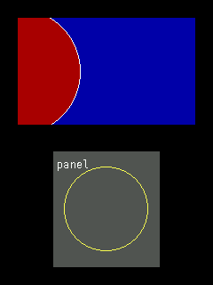

| Parameter | Meaning |
|---|---|
| `x1`, `y1`, `x2`, `y2` | the view's corners in **screen** pixels, both included, any order |
| `move_origin` | `false`: coordinates stay screen coordinates; drawing is only cut off at the view's edges. `true`: `(0, 0)` becomes the view's top-left corner, and percentages measure the view |

**Notes:** everything respects the view: shapes, text, images, [`qg_paint`](#qg_paint), [`qg_put`](blocks.md#qg_put). While a view smaller than the screen is set, [`qg_cls`](#qg_cls) clears just the view, text wraps at its right edge, and printing doesn't scroll (text past its bottom is cut off). **Always [reset](#qg_view_reset) it** when you're done.
**See also:** [`qg_view_pct`](percentages.md#qg_view_pct), [`qg_view_reset`](#qg_view_reset)

---

## qg_view_reset

Removes the view: back to the whole screen, origin at its corner.

```c
void qg_view_reset(qg_screen_t *scr);
```
QuickBasic: `VIEW`

```c example=view_reset
qg_view(&scr, 60, 60, 179, 259, false);
qg_cls(&scr, QG_RED);                       /* only the view turns red */
qg_view_reset(&scr);
qg_box(&scr, 10, 10, 229, 309, QG_WHITE, QG_TRANSPARENT);   /* the whole screen again */
```
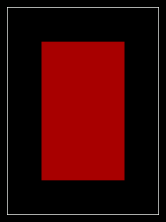

**Notes:** rotating the screen also resets the view.

---

## qg_view_width

The size of the current coordinate space: the view, if its origin was moved; otherwise the screen.

```c
int16_t qg_view_width(const qg_screen_t *scr);
int16_t qg_view_height(const qg_screen_t *scr);
```

```c example=view_width
qg_view(&scr, 40, 60, 199, 179, true);
qg_cls(&scr, QG_BLUE);
/* A border around the view, whatever size it happens to be: */
qg_box(&scr, 0, 0, (int16_t)(qg_view_width(&scr) - 1), (int16_t)(qg_view_height(&scr) - 1),
       QG_YELLOW, QG_TRANSPARENT);
qg_view_reset(&scr);
```
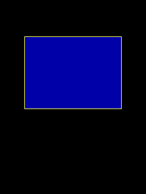

**See also:** [`qg_screen_width`](screens.md#qg_screen_width), [`qg_view`](#qg_view)
