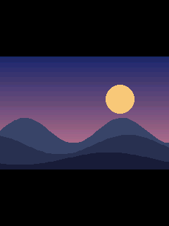
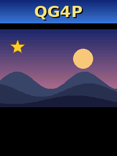
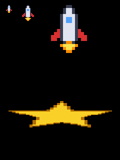
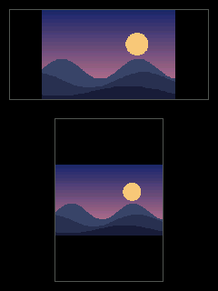
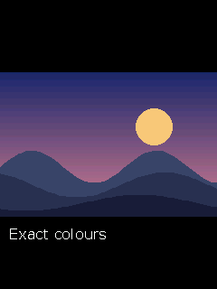

# Images

[open](#qg_image_open) · [size](#qg_image_width) · [draw](#qg_image_draw) · [scaled](#qg_image_draw_scaled) · [fit](#qg_image_draw_fit) · [exact colours](#qg_palette_load_image)

Header: `qg_image.h` (included by `qg4p.h`).

QG4P draws **8-bit BMP** images (plain or RLE8-compressed), each with its own palette of up to 256 colours. `tools/img2bmp8.py` turns PNG, JPG or GIF files into them, either as `.bmp` files for the [asset pack](assets.md) or as C arrays compiled into your program (see [tools](../05-tools.md#img2bmp8py)). The image stays where it is, in flash; nothing is copied into RAM.

The examples here use the example art, already opened: `star` (32x32, see-through background), `ship` (16x16 pixel art, see-through), `scene` (240x160) and `logo` (240x48).

---

## qg_image_open

Checks an image and gets it ready to draw.

```c
qg_err_t qg_image_open(qg_image_t *img, const uint8_t *data, uint32_t size, uint8_t flags);
```

```c example=image_open
static qg_image_t my_star;             /* just a few numbers: the image stays in flash */
if (qg_image_open(&my_star, img_star, img_star_size, QG_IMAGE_TRANSPARENT) == QG_OK) {
    qg_image_draw(&scr, &my_star, 104, 144);
}
```


| Parameter | Meaning |
|---|---|
| `img` | a `qg_image_t` to fill in |
| `data`, `size` | the BMP file's bytes: a C array from `img2bmp8.py --c-array`, or a file from the [asset pack](assets.md#qa_find) |
| `flags` | 0, or `QG_IMAGE_TRANSPARENT` to make palette entry 255 see-through (`img2bmp8.py` tells you which images need it) |
| **returns** | `QG_OK`; `QG_ERR_ARG` if it isn't a readable BMP; `QG_ERR_UNSUPPORTED` if it's a BMP QG4P can't draw (not 8-bit, or wider than `QG_IMAGE_MAX_WIDTH`) |

**Notes:** only reads the header: quick, and nothing is copied.

---

## qg_image_width

An image's size in pixels.

```c
int16_t qg_image_width(const qg_image_t *img);
int16_t qg_image_height(const qg_image_t *img);
```

```c example=image_width
/* Centre the scene on the screen: */
qg_image_draw(&scr, &scene, (int16_t)((240 - qg_image_width(&scene)) / 2),
                            (int16_t)((320 - qg_image_height(&scene)) / 2));
```


---

## qg_image_draw

Draws an image at its own size, top-left corner at `(x, y)`.

```c
void qg_image_draw(qg_screen_t *scr, const qg_image_t *img, int16_t x, int16_t y);
```

```c example=image_draw
qg_image_draw(&scr, &logo, 0, 0);
qg_image_draw(&scr, &scene, 0, 60);
qg_image_draw(&scr, &star, 20, 80);          /* see-through: the scene shows around it */
```


**Notes:** partly off the screen is fine; it's cut off. See-through pixels leave whatever is behind them.

---

## qg_image_draw_scaled

Draws an image stretched to exactly `w` x `h` pixels.

```c
void qg_image_draw_scaled(qg_screen_t *scr, const qg_image_t *img,
                          int16_t x, int16_t y, int16_t w, int16_t h);
```

```c example=image_scaled
qg_image_draw_scaled(&scr, &ship, 10, 10, 16, 16);      /* 1x */
qg_image_draw_scaled(&scr, &ship, 40, 10, 32, 32);      /* 2x */
qg_image_draw_scaled(&scr, &ship, 90, 10, 96, 96);      /* 6x: pixel art stays crisp */
qg_image_draw_scaled(&scr, &star, 10, 200, 220, 60);    /* stretched: width and height separately */
```


**Notes:** scaling picks the nearest source pixel (no smoothing), so pixel art scaled by whole numbers stays sharp.
**See also:** [`qg_image_draw_fit`](#qg_image_draw_fit)

---

## qg_image_draw_fit

Draws an image as large as fits in a box, without changing its shape.

```c
void qg_image_draw_fit(qg_screen_t *scr, const qg_image_t *img,
                       int16_t x, int16_t y, int16_t w, int16_t h, qg_align_t align);
```

```c example=image_fit
qg_box(&scr, 10, 10, 229, 109, QG_DARKGRAY, QG_TRANSPARENT);          /* a wide box  */
qg_image_draw_fit(&scr, &scene, 11, 11, 218, 98, QG_ALIGN_CENTER);
qg_box(&scr, 60, 130, 179, 309, QG_DARKGRAY, QG_TRANSPARENT);         /* a tall box  */
qg_image_draw_fit(&scr, &scene, 61, 131, 118, 178, QG_ALIGN_CENTER);
```


| Parameter | Meaning |
|---|---|
| `x`, `y`, `w`, `h` | the box |
| `align` | where the spare space goes when the image is narrower than the box: `QG_ALIGN_LEFT`, `QG_ALIGN_CENTER` or `QG_ALIGN_RIGHT`. Spare space above and below is always split evenly |

---

## qg_palette_load_image

**Framebuffer screens:** gives an image its exact colours, by copying them into the screen's palette.

```c
int qg_palette_load_image(qg_screen_t *scr, const qg_image_t *img, uint8_t first);
```

```c example=palette_load_image buf8
qg_palette_load_image(&scr, &scene, 16);              /* its own colours, from entry 16 */
qg_image_draw(&scr, &scene, 0, 80);                   /* drawn in exactly its colours   */
qg_print_at(&scr, 10, 250, "Exact colours", QG_WHITE, NULL);   /* named colours untouched */
```


| Parameter | Meaning |
|---|---|
| `first` | the first palette entry to use. 16 keeps the named colours (used by text) intact |
| **returns** | how many colours were copied |

**Notes:** a framebuffer screen has **one** palette of 256 colours for everything on it, so images are matched to the nearest colours already there; with the standard palette, that can be visibly off. DIRECT screens don't need this: images there always use their own palette. Entries from `first` up to 254 are overwritten, and **anything already drawn with those entries changes colour** at the next flush (that's how framebuffer palettes work), so load first, then draw.
