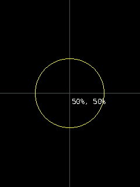
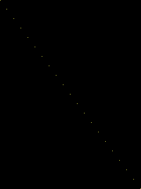
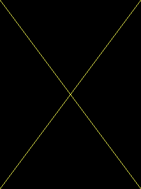
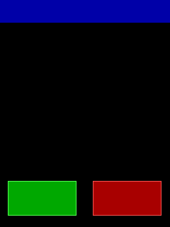
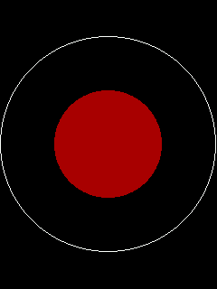
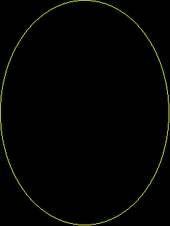
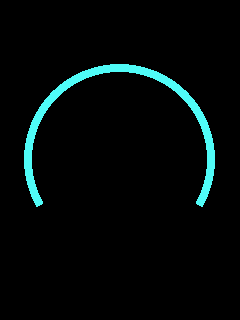
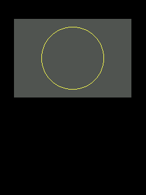

# Percentages

[pct_x / pct_y / pct_r](#qg_pct_x) · [PSET](#qg_pset_pct) · [LINE](#qg_line_pct) · [box](#qg_box_pct) · [CIRCLE](#qg_circle_pct) · [ellipse](#qg_ellipse_pct) · [arc](#qg_arc_pct) · [VIEW](#qg_view_pct) · [LOCATE](text.md#qg_locate_pct)

Header: `qg_draw_pct.h` (included by `qg4p.h`).

Every drawing function has a twin ending in `_pct` that takes **percentages** of the screen instead of pixels, so one layout fits any screen size and any rotation. The same code draws the same picture on a 240x320 screen upright, sideways, or on a 320x480 one.

**The rules, for all of them:**
- `x`: 0 = the leftmost pixel, 100 = the rightmost. `y`: 0 = the top row, 100 = the bottom.
- A circle's radius is a percentage of the screen's **smaller** side, so `(50, 50)` radius `50` just touches the nearest edges whichever way round the screen is. An ellipse's or arc's `rx` is a percentage of the width, and `ry` of the height.
- Whole numbers, rounded down: 50 % of a 240-pixel width is pixel 119 (an even width has no exact middle). Over 100 is allowed and lands off the screen, where it's cut off as usual.
- With a [view](drawing.md#qg_view) whose origin is moved, percentages measure **the view**. Lay out a panel in percentages of itself.
- Colours, stroke and fill: exactly as the pixel versions ([drawing](drawing.md)).

---

## qg_pct_x

Turns a percentage into pixels, for mixing percentages and pixels, or for computing positions yourself.

```c
int16_t qg_pct_x(const qg_screen_t *scr, uint8_t pct);   /* of the width  */
int16_t qg_pct_y(const qg_screen_t *scr, uint8_t pct);   /* of the height */
int16_t qg_pct_r(const qg_screen_t *scr, uint8_t pct);   /* of the smaller side */
```

```c example=pct_x
int16_t x = qg_pct_x(&scr, 50), y = qg_pct_y(&scr, 50);      /* the middle */
qg_line(&scr, x, 0, x, (int16_t)(qg_screen_height(&scr) - 1), QG_DARKGRAY);
qg_line(&scr, 0, y, (int16_t)(qg_screen_width(&scr) - 1), y, QG_DARKGRAY);
qg_circle(&scr, x, y, qg_pct_r(&scr, 25), QG_YELLOW, QG_TRANSPARENT);
qg_print_at(&scr, (int16_t)(x + 4), (int16_t)(y + 4), "{f:2}50%, 50%", QG_WHITE, NULL);
```


**See also:** [`qg_screen_width`](screens.md#qg_screen_width)

---

## qg_pset_pct

[`qg_pset`](drawing.md#qg_pset) in percentages.

```c
void qg_pset_pct(qg_screen_t *scr, uint8_t x, uint8_t y, qg_color_t color);
```

```c example=pset_pct
for (uint8_t p = 0; p <= 100; p += 5) qg_pset_pct(&scr, p, p, QG_YELLOW);   /* a dotted diagonal */
```


---

## qg_line_pct

[`qg_line`](drawing.md#qg_line) in percentages.

```c
void qg_line_pct(qg_screen_t *scr, uint8_t x1, uint8_t y1, uint8_t x2, uint8_t y2, qg_color_t color);
```

```c example=line_pct
qg_line_pct(&scr, 0, 0, 100, 100, QG_YELLOW);      /* corner to corner, any size */
qg_line_pct(&scr, 100, 0, 0, 100, QG_YELLOW);
```


---

## qg_box_pct

[`qg_box`](drawing.md#qg_box) in percentages.

```c
void qg_box_pct(qg_screen_t *scr, uint8_t x1, uint8_t y1, uint8_t x2, uint8_t y2,
                qg_color_t stroke, qg_color_t fill);
```

```c example=box_pct
qg_box_pct(&scr, 0, 0, 100, 10, QG_TRANSPARENT, QG_BLUE);            /* a header bar */
qg_box_pct(&scr, 5, 80, 45, 95, QG_LIGHTGREEN, QG_GREEN);            /* two buttons  */
qg_box_pct(&scr, 55, 80, 95, 95, QG_LIGHTRED, QG_RED);
```


---

## qg_circle_pct

[`qg_circle`](drawing.md#qg_circle) in percentages. The radius is a percentage of the smaller side.

```c
void qg_circle_pct(qg_screen_t *scr, uint8_t cx, uint8_t cy, uint8_t r,
                   qg_color_t stroke, qg_color_t fill);
```

```c example=circle_pct
qg_circle_pct(&scr, 50, 50, 50, QG_WHITE, QG_TRANSPARENT);    /* touches the sides */
qg_circle_pct(&scr, 50, 50, 25, QG_TRANSPARENT, QG_RED);
```


---

## qg_ellipse_pct

[`qg_ellipse`](drawing.md#qg_ellipse) in percentages: `rx` of the width, `ry` of the height.

```c
void qg_ellipse_pct(qg_screen_t *scr, uint8_t cx, uint8_t cy, uint8_t rx, uint8_t ry,
                    qg_color_t stroke, qg_color_t fill);
```

```c example=ellipse_pct
qg_ellipse_pct(&scr, 50, 50, 50, 50, QG_YELLOW, QG_TRANSPARENT);   /* touches all four edges */
```


---

## qg_arc_pct

[`qg_arc`](drawing.md#qg_arc) in percentages: `rx` of the width, `ry` of the height; angles in degrees as usual.

```c
void qg_arc_pct(qg_screen_t *scr, uint8_t cx, uint8_t cy, uint8_t rx, uint8_t ry,
                int16_t start_deg, int16_t end_deg, qg_color_t color);
```

```c example=arc_pct
qg_screen_set_line_width(&scr, 8);
qg_arc_pct(&scr, 50, 50, 40, 30, -30, 210, QG_LIGHTCYAN);
qg_screen_set_line_width(&scr, 1);
```


---

## qg_view_pct

[`qg_view`](drawing.md#qg_view) with its corners as percentages of the **screen**.

```c
void qg_view_pct(qg_screen_t *scr, uint8_t x1, uint8_t y1, uint8_t x2, uint8_t y2, bool move_origin);
```

```c example=view_pct
qg_view_pct(&scr, 10, 10, 90, 50, true);           /* a panel: the top middle */
qg_cls(&scr, QG_DARKGRAY);
qg_circle_pct(&scr, 50, 50, 40, QG_YELLOW, QG_TRANSPARENT);   /* % of the PANEL now */
qg_view_reset(&scr);
```


**Notes:** the corners always measure the screen (a view is placed on the screen); once it's set with `move_origin`, other percentages measure the view.
