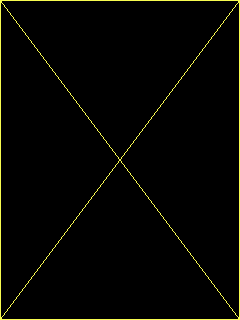
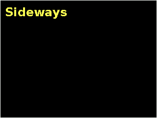
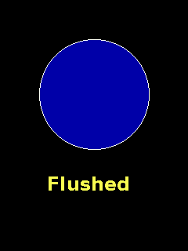
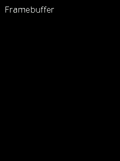

# Screens

[bus](#qg_bus_init) · [screen](#qg_screen_init) · [config fields](#the-screen-config) · [size](#qg_screen_width) · [rotation](#qg_screen_set_rotation) · [backlight](#qg_screen_backlight) · [brightness](#qg_screen_set_brightness) · [flush](#qg_screen_flush) · [flush all](#qg_screen_flush_all) · [buffered?](#qg_screen_is_buffered) · [framebuffer screens](#framebuffer-screens)

Headers: `qg_screen.h`, `hal/qg_hal.h` (both included by `qg4p.h`).

Bringing up a screen takes two steps: describe the **bus** (the shared wires), then each **screen** on it. After that, every drawing call just names the screen. Colour adjustment has its own entry under [colour](colour.md#qg_screen_set_color_adjust).

---

## qg_bus_init

Sets up one SPI bus: the wires every screen on it shares.

```c
qg_err_t qg_bus_init(qg_bus_t *bus, const qg_bus_config_t *cfg);
```

```c example=bus_init compile-only
static qg_bus_t bus;
static const int8_t cs_pins[] = { 17, 22 };       /* EVERY screen's CS on this bus */
const qg_bus_config_t cfg = {
    .spi = spi0, .sck_pin = 18, .mosi_pin = 19, .dc_pin = 20, .rst_pin = 21,
    .cs_pins = cs_pins, .cs_count = 2,
};
if (qg_bus_init(&bus, &cfg) != QG_OK) {
    /* check the pins: SCK and MOSI must belong to the SPI you named */
}
```

| Field | Meaning | Board labels |
|---|---|---|
| `spi` | `spi0` or `spi1`, whichever the SCK and MOSI pins belong to | |
| `sck_pin` | the clock | SCK, SCL, CLK |
| `mosi_pin` | data to the screens | MOSI, SDA, SDI, DIN |
| `dc_pin` | data/command select, any GPIO | DC, RS, A0 |
| `rst_pin` | shared reset, any GPIO, or `QG_PIN_NONE` | RST, RES |
| `cs_pins`, `cs_count` | a list of **every** screen's CS pin on this bus | CS, SS |

| Returns | |
|---|---|
| `QG_OK` | ready |
| `QG_ERR_ARG` | a bad pin, or SCK/MOSI that don't belong to `spi` |

**Notes:** list every screen's CS, even ones you haven't set up yet: the bus holds them all inactive, so an idle screen never mistakes another screen's traffic for its own. The `qg_bus_t` must stay alive (make it `static` or global). Which pins can be SCK and MOSI: see [choosing pins](../07-getting-started.md#choosing-pins).
**See also:** [`qg_screen_init`](#qg_screen_init)

---

## qg_screen_init

Wakes up one screen: runs its chip's start-up sequence, applies the panel's settings, clears it to black, and switches it on.

```c
qg_err_t qg_screen_init(qg_screen_t *scr, qg_bus_t *bus, const qg_screen_config_t *cfg);
```

```c example=screen_init compile-only
static qg_bus_t bus;                  /* set up with qg_bus_init() first */
static qg_screen_t scr_a;
const qg_screen_config_t cfg = {
    .driver = QG_DRIVER_ST7789, .cs_pin = 17, .bl_pin = 16, .bl_active_high = true,
    .spi_hz = 40000000u, .width = 240, .height = 320,
    .invert = true,                   /* this panel's quirks: see docs/WIRING.md */
};
if (qg_screen_init(&scr_a, &bus, &cfg) != QG_OK) {
    /* wrong driver, or a framebuffer backend without a framebuffer */
}
```

| Returns | |
|---|---|
| `QG_OK` | the screen is on, black, and ready |
| `QG_ERR_ARG` | no driver, or a framebuffer backend without a (big enough) framebuffer |

**Notes:** the `qg_screen_t` must stay alive, like the bus. Afterwards: rotation as configured, white on black, line width 1, solid lines, brightness 100 %, no fonts (see [`qg_screen_set_font`](text.md#qg_screen_set_font)), no view. If the screen stays black or looks wrong, see [troubleshooting](../06-troubleshooting.md).

### The screen config

Fields you don't mention are 0, `false` or `NULL`, which is right for most of them.

| Field | Meaning |
|---|---|
| `driver` | the controller chip: `QG_DRIVER_ST7789`, `QG_DRIVER_ILI9341` or `QG_DRIVER_ST7796`. A program only includes the drivers it names |
| `cs_pin` | this screen's chip-select GPIO |
| `bl_pin`, `bl_active_high` | the backlight GPIO (or `QG_PIN_NONE`), and whether HIGH switches it on (usually `true`) |
| `spi_hz` | the SPI speed for this screen. `40000000u` gives 37.5 MHz, the fastest these boards manage on a breadboard |
| `width`, `height` | the glass in pixels, upright (portrait) |
| `x_offset`, `y_offset` | where the glass starts in the chip's memory, for panels smaller than the chip (a strip of garbage along an edge means these are needed) |
| `invert`, `bgr`, `mirror_x`, `mirror_y` | the panel's quirks. Each is a yes/no; if one is wrong, the fix is the other value. See [troubleshooting](../06-troubleshooting.md#help-my-red-looks-blue) and `docs/WIRING.md` |
| `rotation` | the starting [rotation](#qg_screen_set_rotation) |
| `backend` | `QG_BACKEND_DIRECT` (or leave it out), or `QG_BACKEND_BUF8` for a [framebuffer screen](#framebuffer-screens) |
| `framebuffer`, `framebuffer_size` | framebuffer screens only: at least `width x height` bytes, yours |
| `text_history`, `text_history_lines` | DIRECT screens that scroll text: an array of `qg_text_line_t`, yours. See [scrolling](text.md#scrolling) |

---

## qg_screen_width

The screen's current width and height in pixels, which swap when it's turned sideways.

```c
int16_t qg_screen_width(const qg_screen_t *scr);
int16_t qg_screen_height(const qg_screen_t *scr);
```

```c example=screen_width
int16_t w = qg_screen_width(&scr), h = qg_screen_height(&scr);
qg_box(&scr, 0, 0, (int16_t)(w - 1), (int16_t)(h - 1), QG_YELLOW, QG_TRANSPARENT);
qg_line(&scr, 0, 0, (int16_t)(w - 1), (int16_t)(h - 1), QG_YELLOW);
qg_line(&scr, (int16_t)(w - 1), 0, 0, (int16_t)(h - 1), QG_YELLOW);
```


**See also:** [`qg_view_width`](drawing.md#qg_view_width), [percentages](percentages.md)

---

## qg_screen_set_rotation

Turns the screen a quarter turn at a time.

```c
qg_err_t qg_screen_set_rotation(qg_screen_t *scr, qg_rotation_t rot);
```

```c example=rotation
qg_screen_set_rotation(&scr, QG_ROT_90);         /* now 320 wide, 240 tall */
qg_cls(&scr, QG_BLACK);
qg_print_at(&scr, 10, 10, "{f:1}Sideways", QG_DEFAULT, NULL);
qg_box(&scr, 0, 0, 319, 239, QG_WHITE, QG_TRANSPARENT);
```


| Parameter | Meaning |
|---|---|
| `rot` | `QG_ROT_0`, `QG_ROT_90`, `QG_ROT_180` or `QG_ROT_270` |

**Notes:** width and height swap at 90 and 270. Whether 90 turns clockwise depends on how the glass is bonded to the chip; draw some text and see. What's already on the screen isn't moved, so clear and redraw afterwards. Also resets the [view](drawing.md#qg_view).
**See also:** [`qg_screen_width`](#qg_screen_width)

---

## qg_screen_backlight

Switches the backlight on or off.

```c
void qg_screen_backlight(qg_screen_t *scr, bool on);
```

```c example=backlight compile-only
qg_screen_backlight(&scr, false);     /* dark: the picture is still there... */
sleep_ms(1000);
qg_screen_backlight(&scr, true);      /* ...and back, at the last brightness */
```

**Notes:** the picture survives in the panel while the light is off. Needs a `bl_pin` in the screen's config.
**See also:** [`qg_screen_set_brightness`](#qg_screen_set_brightness)

---

## qg_screen_set_brightness

Sets the backlight's brightness, 0 to 100 percent.

```c
void qg_screen_set_brightness(qg_screen_t *scr, uint8_t percent);
uint8_t qg_screen_get_brightness(const qg_screen_t *scr);
```

```c example=brightness compile-only
for (uint8_t p = 100; p > 10; p -= 5) {           /* fade down */
    qg_screen_set_brightness(&scr, p);
    sleep_ms(30);
}
```

**Notes:** uses PWM on the backlight pin, so each screen dims independently. 100 % after start-up. Needs a `bl_pin`.

---

## Framebuffer screens

A screen set up with `.backend = QG_BACKEND_BUF8` and a `.framebuffer` draws into RAM instead of straight onto the glass. Nothing appears until you **flush**, so the viewer only ever sees finished pictures: no flicker. Every drawing function works the same; a few only work here, because they read pixels back: [`qg_point`](drawing.md#qg_point), [`qg_paint`](drawing.md#qg_paint), [`qg_get`](blocks.md#qg_get), and the bitwise [`qg_put`](blocks.md#qg_put) modes.

The price is RAM: one byte per pixel (75 KB for 240x320, 150 KB for 320x480), plus about 5 KB for the framebuffer code, which only programs that name `QG_BACKEND_BUF8` carry.

## qg_screen_flush

Shows everything drawn since the last flush. On a DIRECT screen, does nothing, so it's safe to call on any screen.

```c
void qg_screen_flush(qg_screen_t *scr);
```

```c example=flush buf8
qg_circle(&scr, 120, 120, 70, QG_WHITE, QG_BLUE);       /* in RAM: not visible yet */
qg_print_at(&scr, 60, 220, "{f:1}Flushed", QG_DEFAULT, NULL);
qg_screen_flush(&scr);                                  /* now it is */
```


**Notes:** only the rectangle that changed is sent, so moving something small costs little. A palette change marks the whole screen as changed. On a 320x480 screen a full flush takes about 72 ms (the SPI wire's limit), so about 14 full-screen updates per second; smaller changes are proportionally faster.
**See also:** [`qg_screen_flush_all`](#qg_screen_flush_all) · **How it works:** [the flush](../09-how-it-works.md#the-flush)

---

## qg_screen_flush_all

Sends the whole screen, whether it changed or not.

```c
void qg_screen_flush_all(qg_screen_t *scr);
```

```c example=flush_all buf8
qg_cls(&scr, QG_DARKGRAY);
qg_screen_flush_all(&scr);        /* e.g. after something outside the library disturbed the panel */
```


---

## qg_screen_is_buffered

Is this a framebuffer screen?

```c
bool qg_screen_is_buffered(const qg_screen_t *scr);
```

```c example=is_buffered buf8
qg_print_at(&scr, 10, 10, qg_screen_is_buffered(&scr) ? "Framebuffer" : "Direct",
            QG_WHITE, NULL);
```


**Notes:** useful in code that works on either kind, e.g. to skip reading pixels back on a DIRECT screen.
