# Text

[markup](#markup) · [colour order](#text-colour) · [scrolling](#scrolling) · [QG_FONT_INIT](#qg_font_init) · [font_create](#qg_font_create) · [font_check](#qg_font_check) · [line height](#qg_font_line_height) · [set_font](#qg_screen_set_font) · [LOCATE](#qg_locate) · [locate %](#qg_locate_pct) · [PRINT](#qg_print) · [println](#qg_println) · [print_at](#qg_print_at) · [print_align](#qg_print_align) · [print_box](#qg_print_box) · [measure](#qg_text_measure) · [POS / CSRLIN](#qg_pos) · [text background](#qg_screen_set_text_bg) · [tabs](#qg_screen_set_tab_width) · [wrap](#qg_screen_set_wrap) · [scroll](#qg_screen_set_scroll)

Header: `qg_text.h` (included by `qg4p.h`).

**How text works, in four lines:**
1. A **font** is data (three are built in; `tools/ttf2qg.py` makes more) plus a default colour and size: a `qg_font_t`.
2. Each screen has 4 font **slots**. Slot 0 is used unless you say otherwise; `{f:1}` in the text switches to slot 1.
3. **Printing** happens at the print cursor ([`qg_locate`](#qg_locate), [`qg_print`](#qg_print)) or anywhere you like ([`qg_print_at`](#qg_print_at)).
4. Coordinates are the **top-left** of the text's line. Text is UTF-8, so `"°"` and `"é"` work, if the font has them.

The examples here use the three built-in fonts, already in slots 0 (`font_body`, sans 16), 1 (`font_title`, bold 24, yellow) and 2 (`font_small`, mono 12).

## Markup

Inside any text:

| Markup | Does |
|---|---|
| `\n` | new line, back to the left margin |
| `\r` | back to the left margin, same line |
| `\t` | jump to the next tab stop |
| `{c:RED}` or `{c:200}` | colour, by name (the 16 named colours, any case) or palette number |
| `{f:1}` | font slot 1 (its size, and its colour unless a `{c:}` is active) |
| `{s:2}` | scale 2 (1 to 4): each font pixel becomes a 2x2 block |
| `{x:120}` | jump to pixel column 120, for lining up columns |
| `{c:}` `{f:}` `{s:}` | back to this print's default |
| `{{` | a literal `{` |

Unknown tags are skipped; a `{` with no closing `}` prints as it is.

```c example=markup
qg_locate(&scr, 8, 8);
qg_println(&scr, "{f:1}Markup");
qg_println(&scr, "Plain, {c:LIGHTRED}red{c:}, {c:14}yellow");
qg_println(&scr, "Small, {s:2}BIG{s:}, small");
qg_println(&scr, "{f:2}mono{f:} and {f:1}bold");
qg_println(&scr, "Name{x:120}Score");
qg_println(&scr, "Ann{x:120}{c:LIGHTGREEN}42");
qg_println(&scr, "{{brace}, tab:\tok");
```
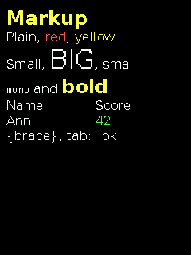

## Text colour

The first of these that applies wins:
1. the colour given to [`qg_print_at`](#qg_print_at), if it isn't `QG_DEFAULT`;
2. the font's own colour, if it isn't `QG_DEFAULT`;
3. the screen's foreground colour ([`qg_screen_set_colors`](drawing.md#qg_screen_set_colors)).

`{c:...}` markup overrides all three until `{c:}`.

## Scrolling

When [`qg_print`](#qg_print) or [`qg_println`](#qg_println) run past the bottom of the screen, everything moves up, QuickBasic style.
- **Framebuffer screens** move the pixels up: everything scrolls, shapes included, and it costs nothing extra.
- **DIRECT screens** can't move pixels, so they clear and reprint the lines they remember. For that they need **text history**: an array you give in the screen's config (`.text_history`, `.text_history_lines`; see [screens](screens.md#the-screen-config)). 32 lines (about 4 KB) covers any screen. Only text scrolls; shapes drawn in between are cleared. Without history, printing past the bottom clears the screen and carries on at the top.
- With a smaller [view](drawing.md#qg_view) set, printing doesn't scroll: text past its bottom is cut off.
- [`qg_print_at`](#qg_print_at), [`qg_print_align`](#qg_print_align) and [`qg_print_box`](#qg_print_box) never scroll.

---

## QG_FONT_INIT

Declares a font: font data plus its default colour and scale.

```c
#define QG_FONT_INIT(font_data, color, scale)
```

```c example=font_init
static qg_font_t big_red = QG_FONT_INIT(qg_font_sans_bold_24, QG_LIGHTRED, 2);
qg_print_at(&scr, 10, 100, "Big red", QG_DEFAULT, &big_red);
```
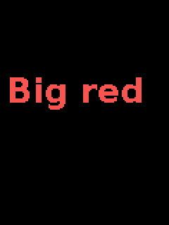

| Parameter | Meaning |
|---|---|
| `font_data` | the font: `qg_font_mono_12`, `qg_font_sans_16`, `qg_font_sans_bold_24`, or one you made with `tools/ttf2qg.py` |
| `color` | its default colour, or `QG_DEFAULT` for the screen's foreground |
| `scale` | 1 to 4 |

**Notes:** for a `static` or global `qg_font_t`, which is what screens need (they keep a pointer to it). A program only carries the fonts it names.
**See also:** [`qg_font_create`](#qg_font_create), [`qg_screen_set_font`](#qg_screen_set_font), [making fonts](../05-tools.md#ttf2qgpy)

---

## qg_font_create

Makes a font at run time: the same as [`QG_FONT_INIT`](#qg_font_init), as a function.

```c
qg_font_t qg_font_create(const lv_font_t *data, qg_color_t color, uint8_t scale);
```

```c example=font_create
static qg_font_t f;
f = qg_font_create(&qg_font_mono_12, QG_LIGHTCYAN, 3);
qg_print_at(&scr, 10, 100, "Mono x3", QG_DEFAULT, &f);
```
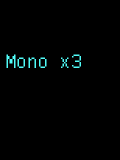

**Notes:** scales outside 1 to 4 are brought into range.

---

## qg_font_check

Checks that font data is in a form QG4P can draw.

```c
qg_err_t qg_font_check(const lv_font_t *data);
```

```c example=font_check
qg_print_at(&scr, 10, 10, qg_font_check(&qg_font_sans_16) == QG_OK ? "sans 16: OK" : "sans 16: no",
            QG_WHITE, NULL);
```
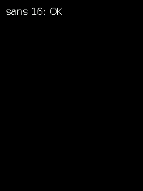

| Returns | |
|---|---|
| `QG_OK` | drawable |
| `QG_ERR_UNSUPPORTED` | a format QG4P doesn't draw (it supports 1 bit per pixel, uncompressed, as `ttf2qg.py` makes) |
| `QG_ERR_ARG` | no data |

**Notes:** worth calling once on fonts converted with other tools (LVGL's online converter, for instance).

---

## qg_font_line_height

How tall a line of this font is, in pixels, at its scale.

```c
int16_t qg_font_line_height(const qg_font_t *font);
```

```c example=font_line_height
int16_t y = 10;
const qg_font_t *fonts[3] = { &font_small, &font_body, &font_title };
for (int i = 0; i < 3; i++) {
    qg_print_at(&scr, 10, y, "Line", QG_WHITE, fonts[i]);
    y = (int16_t)(y + qg_font_line_height(fonts[i]));      /* the next line */
}
```
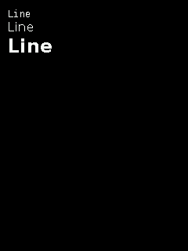

---

## qg_screen_set_font

Puts a font in one of a screen's slots.

```c
qg_err_t qg_screen_set_font(qg_screen_t *scr, uint8_t slot, const qg_font_t *font);
```

```c example=set_font
static qg_font_t mono_big = QG_FONT_INIT(qg_font_mono_12, QG_LIGHTGREEN, 2);
qg_screen_set_font(&scr, 3, &mono_big);                     /* slot 3 */
qg_print_at(&scr, 10, 10, "Slot 0, then {f:3}slot 3", QG_DEFAULT, NULL);
```
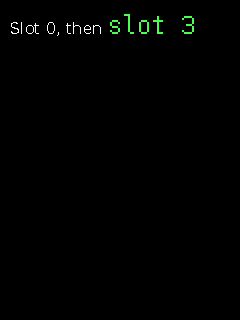

| Parameter | Meaning |
|---|---|
| `slot` | 0 to 3. Slot 0 is the default for printing |
| `font` | a font that stays alive (`static` or global), or `NULL` to empty the slot |
| **returns** | `QG_OK`; `QG_ERR_ARG` for a bad slot or missing font data; `QG_ERR_UNSUPPORTED` for a font format QG4P can't draw (it checks, as [`qg_font_check`](#qg_font_check) does) |

**Notes:** a screen starts with no fonts: put one in slot 0 before printing (the examples' `board.c` fills all three). With slot 0 empty, printing draws nothing.

---

## qg_locate

Moves the print cursor, and sets the left margin new lines return to.

```c
void qg_locate(qg_screen_t *scr, int16_t x, int16_t y);
```
QuickBasic: `LOCATE row, column` (in pixels here, not character cells)

```c example=locate
qg_locate(&scr, 40, 60);
qg_println(&scr, "Indented block:");
qg_println(&scr, "every new line");
qg_println(&scr, "starts at x = 40");
```
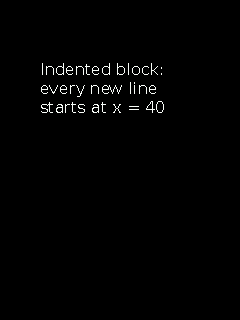

**See also:** [`qg_locate_pct`](#qg_locate_pct), [`qg_pos`](#qg_pos)

---

## qg_locate_pct

[`qg_locate`](#qg_locate) in percentages.

```c
void qg_locate_pct(qg_screen_t *scr, uint8_t x, uint8_t y);
```

```c example=locate_pct
qg_locate_pct(&scr, 10, 50);
qg_println(&scr, "Halfway down");
```
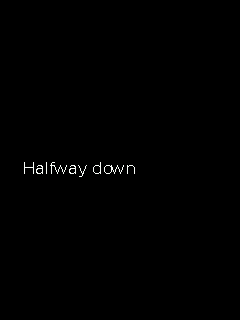

---

## qg_print

Prints at the cursor; the cursor moves on.

```c
void qg_print(qg_screen_t *scr, const char *text);
```
QuickBasic: `PRINT "text";`

```c example=print
qg_locate(&scr, 10, 10);
qg_print(&scr, "One, ");
qg_print(&scr, "two, ");
qg_print(&scr, "three.");
```
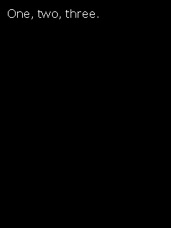

**Notes:** wraps at the screen's (or view's) right edge; scrolls at the bottom (see [scrolling](#scrolling)). To print numbers, format them first with `snprintf`.
**See also:** [`qg_println`](#qg_println), [`qg_print_at`](#qg_print_at)

---

## qg_println

[`qg_print`](#qg_print), then a new line.

```c
void qg_println(qg_screen_t *scr, const char *text);
```
QuickBasic: `PRINT "text"`

```c example=println
char line[32];
qg_locate(&scr, 10, 10);
for (int i = 1; i <= 5; i++) {
    snprintf(line, sizeof line, "Line %d", i);
    qg_println(&scr, line);
}
```
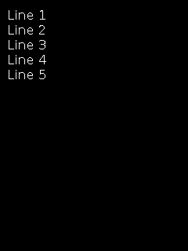

---

## qg_print_at

Prints anywhere, in any font and colour, without moving the cursor.

```c
void qg_print_at(qg_screen_t *scr, int16_t x, int16_t y, const char *text,
                 qg_color_t color, const qg_font_t *font);
```

```c example=print_at
qg_print_at(&scr, 10, 10, "Default font, white", QG_WHITE, NULL);
qg_print_at(&scr, 10, 40, "Title font", QG_DEFAULT, &font_title);
qg_print_at(&scr, 10, 80, "Two lines:\nback to x", QG_LIGHTCYAN, NULL);
```
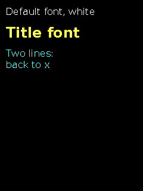

| Parameter | Meaning |
|---|---|
| `x`, `y` | the top-left of the first line; `\n` returns to `x` |
| `color` | text colour, or `QG_DEFAULT` (see [text colour](#text-colour)) |
| `font` | a font, or `NULL` for slot 0 |

**Notes:** wraps at the right edge (if wrapping is on), never scrolls.

---

## qg_print_align

Prints each line aligned left, centred or right across the screen (or view).

```c
void qg_print_align(qg_screen_t *scr, int16_t y, const char *text, qg_align_t align);
```

```c example=print_align
qg_print_align(&scr, 20, "Left", QG_ALIGN_LEFT);
qg_print_align(&scr, 50, "{f:1}Centred", QG_ALIGN_CENTER);
qg_print_align(&scr, 90, "Right", QG_ALIGN_RIGHT);
qg_print_align(&scr, 140, "A longer sentence wraps, and every line is centred.", QG_ALIGN_CENTER);
```
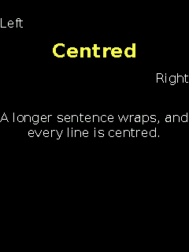

| Parameter | Meaning |
|---|---|
| `y` | the top of the first line |
| `align` | `QG_ALIGN_LEFT`, `QG_ALIGN_CENTER` or `QG_ALIGN_RIGHT` |

---

## qg_print_box

Prints inside a column: wrapped to fit its width, each line aligned within it.

```c
void qg_print_box(qg_screen_t *scr, int16_t x, int16_t y, int16_t width,
                  const char *text, qg_align_t align);
```

```c example=print_box
qg_box(&scr, 20, 40, 219, 160, QG_DARKGRAY, QG_TRANSPARENT);
qg_print_box(&scr, 28, 48, 184,
             "This paragraph wraps to fit its box, and each line is {c:YELLOW}centred{c:}.",
             QG_ALIGN_CENTER);
```
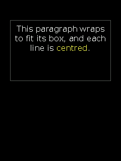

| Parameter | Meaning |
|---|---|
| `x`, `y` | the column's top-left |
| `width` | the column's width in pixels |
| `align` | as for [`qg_print_align`](#qg_print_align) |

**Notes:** uses the slot 0 font (markup can switch). Pair it with [`qg_text_measure`](#qg_text_measure) to size a box to its text.

---

## qg_text_measure

Measures text without drawing it: its width and height in pixels.

```c
void qg_text_measure(qg_screen_t *scr, const char *text, const qg_font_t *font,
                     int16_t max_width, int16_t *w, int16_t *h);
```

```c example=text_measure
const char *msg = "{f:1}Measured";
int16_t w, h;
qg_text_measure(&scr, msg, NULL, 0, &w, &h);
int16_t x = (int16_t)((240 - w) / 2), y = 140;                 /* centre it by hand */
qg_box(&scr, (int16_t)(x - 6), (int16_t)(y - 4), (int16_t)(x + w + 5), (int16_t)(y + h + 3),
       QG_TRANSPARENT, QG_BLUE);
qg_print_at(&scr, x, y, msg, QG_DEFAULT, NULL);
```
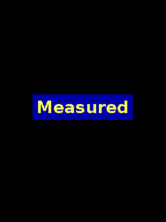

| Parameter | Meaning |
|---|---|
| `font` | a font, or `NULL` for slot 0 |
| `max_width` | wrap at this width, as printing would; 0 = don't wrap |
| `w`, `h` | where to put the widest line's width and the total height (either may be `NULL`) |

**Notes:** markup, tabs, scaling and wrapping all count, exactly as printing would.

---

## qg_pos

Where the print cursor is, in pixels.

```c
int16_t qg_pos(const qg_screen_t *scr);       /* x */
int16_t qg_csrlin(const qg_screen_t *scr);    /* y */
```
QuickBasic: `POS(0)` and `CSRLIN` (which counted character cells, not pixels)

```c example=pos
char where[32];
qg_locate(&scr, 10, 10);
qg_print(&scr, "Here: ");
snprintf(where, sizeof where, "x %d, y %d", qg_pos(&scr), qg_csrlin(&scr));
qg_println(&scr, where);
```
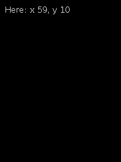

**Notes:** relative to the view's origin, if a [view](drawing.md#qg_view) moved it.

---

## qg_screen_set_text_bg

Gives text a solid background (opaque), or none (transparent, the default).

```c
void qg_screen_set_text_bg(qg_screen_t *scr, qg_color_t bg);
```

```c example=text_bg
qg_box(&scr, 0, 0, 239, 319, QG_TRANSPARENT, QG_BLUE);
qg_print_at(&scr, 10, 40, "Transparent", QG_WHITE, NULL);
qg_screen_set_text_bg(&scr, QG_BLACK);
qg_print_at(&scr, 10, 80, "Opaque", QG_WHITE, NULL);
qg_screen_set_text_bg(&scr, QG_TRANSPARENT);
```
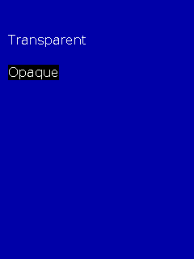

**Notes:** opaque text paints its own background, so a changing number simply covers the old one: no erasing, no flicker, and about three times faster than erasing first. **For numbers that change, use a monospaced font** (`font_small`, `{f:2}`): in a proportional font a space is narrower than a digit, so `" 42"` doesn't fully cover `"118"`.

---

## qg_screen_set_tab_width

Sets the distance between tab stops, in pixels (40 after start-up).

```c
void qg_screen_set_tab_width(qg_screen_t *scr, int16_t pixels);
```

```c example=tab_width
qg_screen_set_tab_width(&scr, 70);
qg_locate(&scr, 10, 10);
qg_println(&scr, "{c:YELLOW}Item\tQty\tCost");
qg_println(&scr, "Rope\t2\t5 gp");
qg_println(&scr, "Torch\t10\t1 gp");
qg_screen_set_tab_width(&scr, 40);
```
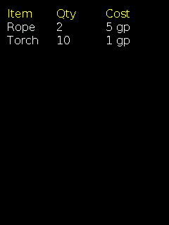

**Notes:** stops are measured from the left margin (see [`qg_locate`](#qg_locate)).

---

## qg_screen_set_wrap

Word wrap at the right edge: on (the default) or off.

```c
void qg_screen_set_wrap(qg_screen_t *scr, bool on);
```

```c example=wrap
const char *long_text = "This sentence is too long for one line of the screen.";
qg_print_at(&scr, 10, 20, long_text, QG_WHITE, NULL);
qg_screen_set_wrap(&scr, false);
qg_print_at(&scr, 10, 120, long_text, QG_LIGHTRED, NULL);   /* cut off at the edge */
qg_screen_set_wrap(&scr, true);
```
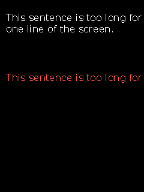

**Notes:** wrapping breaks at spaces and tabs; a word longer than a whole line is split.

---

## qg_screen_set_scroll

Scrolling at the bottom: on (the default) or off.

```c
void qg_screen_set_scroll(qg_screen_t *scr, bool on);
```

```c example=scroll compile-only
qg_screen_set_scroll(&scr, false);     /* past the bottom, text is simply cut off */
```

**See also:** [scrolling](#scrolling)
